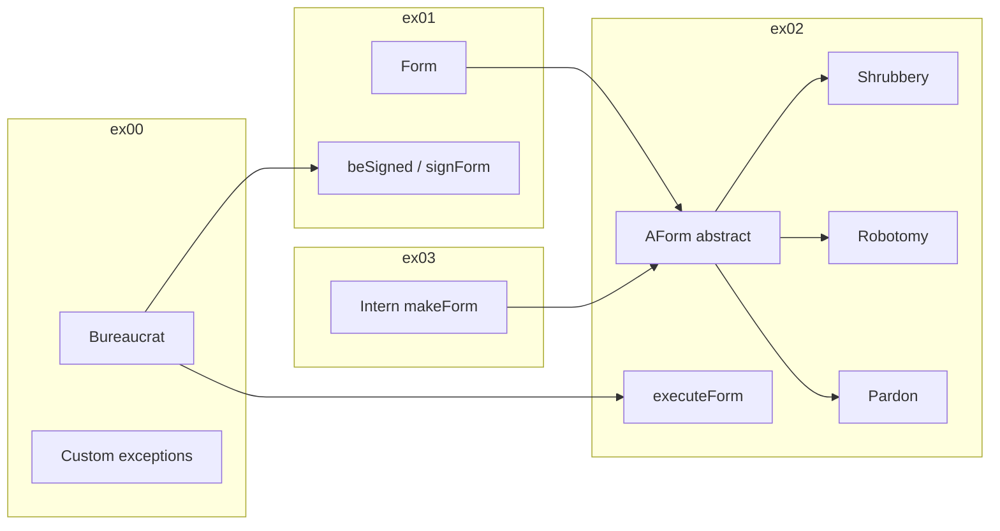

# CPP05 — Exercise breakdown

## How module validation works

At 42 / The Hive, **every exercise in the subject is mandatory** for a full module pass:

| Status | Meaning |
|--------|---------|
| **Mandatory** | Required for **100/100** on CPP05. Submitted and evaluated separately in `ex00/` … `ex03/`. |
| **Bonus** | Optional extra in an exercise — not required to pass. |

CPP05 has **no optional exercises**. All four must pass peer evaluation and behave per the subject.

**Progression rule:** Each exercise folder must contain everything from previous exercises plus the new files (cumulative turn-in).

---

## Module concepts

### Exception handling

Exceptions separate **error detection** from **error handling**. When code cannot complete a contract (invalid grade, unsigned form), it **throws** an object; a caller **catches** it elsewhere—often in `main` or a thin wrapper method.

```cpp
try {
    bureaucrat.incrementGrade();
} catch (const std::exception& e) {
    std::cerr << e.what() << std::endl;
}
```

**Catch by reference** — catching by value slices polymorphic exception types and adds copies.

### Custom exceptions and nested classes

All standard exceptions derive from `std::exception`, which provides `virtual const char* what() const throw();`. In C++20, custom exceptions typically:

1. Inherit `public std::exception`
2. Override `what()` with `noexcept override`
3. Live as **nested classes** inside `Bureaucrat` or `AForm`/`Form` for locality (`Bureaucrat::GradeTooHighException`)

### The bureaucrat grade system (critical)

| Value | Meaning |
|-------|---------|
| **1** | Highest grade (most authority) |
| **150** | Lowest grade (least authority) |

- `incrementGrade()` → grade number **decreases** (bureaucrat gets **better**)
- `decrementGrade()` → grade number **increases** (bureaucrat gets **worse**)
- Signing/executing: bureaucrat qualifies when `bureaucrat.getGrade() <= form.getGradeToSign()` or `<= form.getGradeToExecute()` respectively (lower number = better)

Memorize this early—it confuses almost everyone.

### Orthodox Canonical Form (OCF)

| Function | Purpose |
|----------|---------|
| Default constructor | Sometimes private/unused if not needed |
| Copy constructor | Deep copy if pointers are owned |
| Copy assignment operator | Self-assignment safe; return `*this` |
| Destructor | Release owned resources |

**ex00 exception:** `Bureaucrat` does **not** require OCF in exercise 00 only.

### const members

`const` data members must be initialized in the **constructor initializer list** and cannot be reassigned. `Form`/`AForm` use `const` for name and grade thresholds—copy assignment often reassigns only the `_signed` flag or is simplified per subject rules.

### When to throw

Use exceptions for **exceptional** control flow (invalid state, failed contract)—not for normal program logic. Throw from constructors when an object cannot be validly created; throw from mutators when an operation would violate invariants. If an exception escapes during construction, the partially built object is destroyed.

### Concept map across exercises



---

## ex00 — Mommy, when I grow up, I want to be a bureaucrat!

| | |
|---|---|
| **Mandatory** | Yes |
| **Turn-in** | `ex00/` |
| **Files** | `Makefile`, `main.cpp`, `Bureaucrat.{h,hpp,cpp}` |

### Concepts

- Model a class with validation in constructors and mutators
- Throw typed exceptions instead of returning error codes
- Implement `operator<<` for readable output
- **Where to throw:** constructor for bad initial grade; mutators for boundary crossing
- **No `signForm` yet** — that arrives in ex01

### Requirements

| Requirement | Detail |
|-------------|--------|
| `_name` | `const std::string` |
| `_grade` | `unsigned int`, range [1, 150] |
| `getName()`, `getGrade()` | `const` methods |
| Constructor | Invalid grade (`< 1` or `> 150`) → throw appropriate exception |
| `incrementGrade()` | Decrease grade by 1; at grade **1** → `GradeTooHighException` |
| `decrementGrade()` | Increase grade by 1; at grade **150** → `GradeTooLowException` |
| Exceptions | Nested `GradeTooHighException` (grade would go **above** authority, below 1), `GradeTooLowException` (grade would go **below** authority, above 150); both inherit `std::exception` with `what()` |
| `operator<<` | Output: `<name>, bureaucrat grade <grade>.` (verify exact punctuation in subject) |
| OCF | **Not required** for `Bureaucrat` in ex00 only (subject exemption) |
| `main` | Use **try/catch** to demonstrate exceptions |

### Pitfalls & evaluator checks

| Pitfall | Evaluator check |
|---------|-----------------|
| Inverting increment/decrement direction | Boundary grades **1** and **150** behave correctly |
| Catching exceptions by value | Constructor throws on **0**, **151**, and other invalid values |
| Forgetting `const` on getters | Output format exact: `<name>, bureaucrat grade <grade>.` |
| Implementing OCF when ex00 exempts `Bureaucrat` | `main` demonstrates try/catch; no memory leaks |

---

## ex01 — Form up, maggots!

| | |
|---|---|
| **Mandatory** | Yes |
| **Turn-in** | `ex01/` |
| **Files** | ex00 files + `Form.{h,hpp,cpp}` |

### Concepts

- Compose two classes with cross-dependencies
- Validate in multiple layers (form grades + bureaucrat ability)
- Propagate exceptions while providing user-friendly messages at the boundary
- `Form` may define its own `GradeTooHighException` / `GradeTooLowException` for invalid **form** grade constants at construction—distinct from `Bureaucrat`'s nested types (usually keep separate nested classes per enclosing type)

**Signing rule** (lower number = higher authority):

```text
bureaucrat.getGrade() <= form.getGradeToSign()  →  can sign
```

### Requirements

| Requirement | Detail |
|-------------|--------|
| `_name` | `const std::string` |
| `_signed` | `bool`, default `false` |
| `_gradeToSign` | `const unsigned int` |
| `_gradeToExecute` | `const unsigned int` (used in ex02) |
| Form constructor | Invalid grade constants → throw (same 1–150 rules) |
| `beSigned(Bureaucrat const&)` | If `bureaucrat.getGrade() <= _gradeToSign` → `_signed = true`; else throw |
| `Bureaucrat::signForm(Form&)` | Calls `beSigned` inside `try`; on success print signed message; on `catch` print failure with `e.what()` |
| Exceptions | `GradeTooHighException`, `GradeTooLowException` on `Form` (for invalid form grades) |
| OCF | **Required** on `Form` |

### Pitfalls & evaluator checks

| Pitfall | Evaluator check |
|---------|-----------------|
| Signing an already-signed form (subject may require no-op or exception—check PDF) | Low-grade bureaucrat **cannot** sign high-requirement form |
| Duplicating grade-check logic inconsistently between classes | `signForm` prints success or failure message (with `e.what()` on failure) |
| Missing OCF on `Form` | Form stays **signed** after successful sign; OCF on `Form` |

---

## ex02 — No, you need form 28B, not 28C...

| | |
|---|---|
| **Mandatory** | Yes |
| **Turn-in** | `ex02/` |
| **Files** | Previous + rename `Form` → `AForm`; add `ShrubberyCreationForm`, `RobotomyRequestForm`, `PresidentialPardonForm` |

### Concepts

- Refactor concrete `Form` into abstract `AForm`
- Use **pure virtual** functions for per-type behavior
- Combine exceptions with **runtime polymorphism** and file I/O / pseudo-random behavior
- **Template method idea:** `execute()` checks signed + executor grade, then calls derived `executeAction()`—centralizing checks avoids duplication in every form

```cpp
class AForm {
public:
    virtual void execute(Bureaucrat const& executor) const;
    virtual void executeAction() const = 0;
    virtual ~AForm();
};
```

`virtual ~AForm()` is essential when deleting derived objects via `AForm*`. `execute` must work through `AForm const&` or pointer.

### Requirements

| Requirement | Detail |
|-------------|--------|
| `AForm` | Abstract base; pure virtual or template-method `execute(Bureaucrat const&)` |
| Pre-execute checks | Form must be **signed**; executor grade ≤ grade to execute |
| `FormNotSignedException` | Thrown when executing unsigned form |
| `Bureaucrat::executeForm(AForm const&)` | Try execute; print success/failure (mirror `signForm` pattern) |
| Virtual destructor | On `AForm` |
| Concrete forms | See grade table below; each takes a `std::string` **target** at construction |

**Concrete form grades and actions (subject):**

| Form | Sign grade | Execute grade | Action |
|------|------------|---------------|--------|
| `ShrubberyCreationForm` | 145 | 137 | Create file `<target>_shrubbery` with ASCII art trees (`std::ofstream`, check `is_open()`) |
| `RobotomyRequestForm` | 72 | 45 | Drilling noise to stdout; **50%** chance of successful robotomy (`std::rand()`, `std::srand(std::time())`) |
| `PresidentialPardonForm` | 25 | 5 | Announce that `<target>` has been pardoned by Zaphod Beeblebrox |

### Pitfalls & evaluator checks

| Pitfall | Evaluator check |
|---------|-----------------|
| Checking sign/grade only in derived class (duplication) | Cannot execute **unsigned** form → `FormNotSignedException` |
| Forgetting to seed random generator (same result every run) | Insufficient executor grade throws |
| File in wrong directory or wrong filename pattern | Each form's **unique** behaviour (trees, robotomy, pardon) |
| Non-virtual destructor → UB on `delete` through base pointer | Shrubbery file `<target>_shrubbery` created; polymorphism through `AForm const&` |

---

## ex03 — At least this beats coffee-making

| | |
|---|---|
| **Mandatory** | Yes |
| **Turn-in** | `ex03/` |
| **Files** | Previous + `Intern.{h,hpp,cpp}` |

### Concepts

- Create objects dynamically by string name (**factory pattern**)
- Avoid unmaintainable if/else chains; prefer extensible dispatch
- Manage ownership of heap-allocated `AForm*` — `makeForm` returns raw pointer; **caller deletes**

**Factory strategies:** (1) static array of function pointers with parallel name strings — preferred; (2) static map — only if you implement without STL (`std::map` forbidden); (3) long if/else — works but poor design.

```cpp
typedef AForm* (*Creator)(std::string const& target);
struct FormEntry { const char* name; Creator create; };
```

Adding a fourth form type should require minimal changes (ideally one table entry + new class).

### Requirements

| Requirement | Detail |
|-------------|--------|
| `makeForm(name, target)` | Returns `AForm*` to new form on match |
| Valid names | `"shrubbery creation"` → `ShrubberyCreationForm`; `"robotomy request"` → `RobotomyRequestForm`; `"presidential pardon"` → `PresidentialPardonForm` (exact strings, lowercase) |
| Unknown name | Print error; return `nullptr` **or** throw (no custom exception required—pick one and use consistently) |
| OCF | Required on `Intern` (can be minimal if class holds no state) |
| Memory | Caller can `delete` returned pointer |

### Pitfalls & evaluator checks

| Pitfall | Evaluator check |
|---------|-----------------|
| String mismatch (`"Shrubbery Creation"` vs `"shrubbery creation"`) | `"shrubbery creation"` → `ShrubberyCreationForm`; `"robotomy request"` → `RobotomyRequestForm`; `"presidential pardon"` → `PresidentialPardonForm` |
| Memory leak in `main` after intern creates forms | Caller can `delete` returned `AForm*` without leak |
| Copying `Intern` without OCF | Unknown form name handled gracefully (error print or throw per your choice) |
| — | Full flow: intern creates → bureaucrat signs → bureaucrat executes |

---

## Module checklist

- [ ] All four exercises in separate directories
- [ ] `-std=c++20 -Wall -Wextra -Werror`
- [ ] No STL containers / `<algorithm>`
- [ ] OCF everywhere except ex00 `Bureaucrat`

### Evaluation topics to rehearse

Be ready to explain without notes:

1. Difference between `throw`, `try`, and `catch`
2. Why inherit from `std::exception`
3. What happens if an exception is not caught
4. Why `AForm` needs a virtual destructor
5. Grade comparison for sign vs execute
6. How `Intern` would register a fourth form type
7. Why STL containers are forbidden in this module
