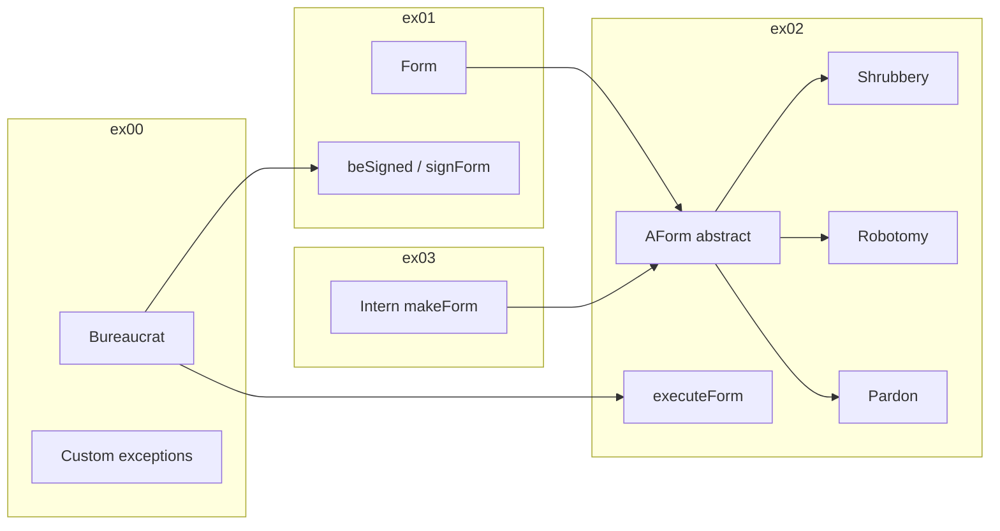

# CPP05 — Theory and concepts (by exercise)

---

## Module-wide concepts

### Exception handling in C++

Exceptions separate **error detection** from **error handling**. When code cannot complete a contract (invalid grade, unsigned form), it **throws** an object; a caller **catches** it elsewhere—often in `main` or a thin wrapper method.

```cpp
try {
    bureaucrat.incrementGrade();
} catch (const std::exception& e) {
    std::cerr << e.what() << std::endl;
}
```

**Why catch by reference?** Catching by value slices polymorphic exception types; catching by reference preserves the dynamic type and avoids extra copies.

### Custom exceptions and `std::exception`

All standard exceptions derive from `std::exception`, which provides:

```cpp
virtual const char* what() const throw();
```

In C++20, custom exceptions typically:

1. Inherit `public std::exception`
2. Override `what()` with `noexcept override`
3. Live as **nested classes** inside `Bureaucrat` or `AForm` for locality

### Nested classes

A class defined inside another class is a **nested class**. CPP05 uses them for exceptions (`Bureaucrat::GradeTooHighException`). They are in the enclosing class's scope and signal that the exception belongs to that type's contract.

### The bureaucrat grade system (critical)

| Value | Meaning |
|-------|---------|
| **1** | Highest grade (most authority) |
| **150** | Lowest grade (least authority) |

- `incrementGrade()` → grade number **decreases** (bureaucrat gets **better**)
- `decrementGrade()` → grade number **increases** (bureaucrat gets **worse**)
- Comparison for signing/executing: bureaucrat can sign if `bureaucrat.getGrade() <= form.getGradeToSign()` (lower number = better)

Memorize this early—it confuses almost everyone.

### Orthodox Canonical Form (OCF)

From CPP02 onward, most classes need:

| Function | Purpose |
|----------|---------|
| Default constructor | Sometimes private/unused if not needed |
| Copy constructor | Deep copy if pointers are owned |
| Copy assignment operator | Self-assignment safe; return `*this` |
| Destructor | Release owned resources |

**ex00 exception:** `Bureaucrat` does **not** require OCF in exercise 00 only.

### const members

`const` data members must be initialized in the **constructor initializer list** and cannot be reassigned. `Form`/`AForm` use `const` for name and grade thresholds—copy assignment often reassigns only the `_signed` flag or is simplified per subject rules.

---

## ex00 — Bureaucrat and grade exceptions

### Learning objectives

- Model a simple class with validation in constructors and mutators
- Throw typed exceptions instead of returning error codes
- Implement `operator<<` for readable output

### Required class behavior

**`Bureaucrat`**

| Member / method | Notes |
|-----------------|-------|
| `_name` | `const std::string` |
| `_grade` | `unsigned int`, range [1, 150] |
| `getName()`, `getGrade()` | `const` methods |
| `incrementGrade()` | If grade is already 1 → `GradeTooHighException` |
| `decrementGrade()` | If grade is already 150 → `GradeTooLowException` |
| Constructor | Invalid initial grade → throw appropriate exception |

**Exceptions**

- `GradeTooHighException` — grade would go above authority (below 1)
- `GradeTooLowException` — grade would go below authority (above 150)

### Design decisions

- **Where to throw:** Constructor for bad initial grade; mutators for boundary crossing
- **Output format:** `<name>, bureaucrat grade <grade>.` (verify exact punctuation in subject)
- **No `signForm` yet** — that arrives in ex01

### Common pitfalls

- Inverting increment/decrement direction
- Catching exceptions by value
- Forgetting `const` on getters
- Implementing OCF when ex00 subject exempts `Bureaucrat`

---

## ex01 — Form and signing

### Learning objectives

- Compose two classes with cross-dependencies
- Validate in multiple layers (form grades + bureaucrat ability)
- Propagate exceptions while providing user-friendly messages at boundary

### Required class behavior

**`Form`**

| Member | Notes |
|--------|-------|
| `_name` | `const std::string` |
| `_signed` | `bool`, default `false` |
| `_gradeToSign` | `const unsigned int` |
| `_gradeToExecute` | `const unsigned int` (used in ex02) |
| `beSigned(Bureaucrat const&)` | If bureaucrat grade is good enough, set `_signed = true`; else throw |

**`Bureaucrat` addition**

```cpp
void signForm(Form& form);
```

Typical pattern:

1. `signForm` calls `form.beSigned(*this)` inside `try`
2. On success: print that bureaucrat signed the form
3. On `catch`: print that signing failed with `e.what()`

### Signing rule

Bureaucrat can sign when:

```text
bureaucrat.getGrade() <= form.getGradeToSign()
```

(Lower grade number = better bureaucrat.)

### Exception reuse

`Form` may define its own `GradeTooHighException` / `GradeTooLowException` for invalid **form** grade constants at construction—distinct from `Bureaucrat`'s nested types unless you factor shared exceptions (usually keep separate nested classes per enclosing type).

### Common pitfalls

- Signing an already-signed form (subject may require no-op or exception—check PDF)
- Duplicating grade-check logic inconsistently between classes
- Missing OCF on `Form`

---

## ex02 — AForm, polymorphic execution

### Learning objectives

- Refactor concrete `Form` into abstract `AForm`
- Use **pure virtual** functions for per-type behavior
- Combine exceptions with **runtime polymorphism**
- File I/O and pseudo-random behavior

### Abstract base class pattern

`AForm` holds shared state and shared validation; derived classes implement specific **actions**.

Typical structure:

```cpp
class AForm {
public:
    virtual void execute(Bureaucrat const& executor) const;
    virtual void executeAction() const = 0;  // or similar hook name per your design
    virtual ~AForm();
    // ...
};
```

**Template method idea:** `execute()` checks signed + executor grade, then calls derived `executeAction()`. Centralizing checks avoids duplication in every form.

### New exception

- **`FormNotSignedException`** — thrown when `execute` is called on an unsigned form

### Concrete forms

#### ShrubberyCreationForm

| Property | Value |
|----------|-------|
| Sign grade | 145 |
| Execute grade | 137 |
| Target | `std::string` passed at construction |
| Behavior | Create file `<target>_shrubbery` with ASCII art trees |

Concepts: `std::ofstream`, checking `is_open()`, writing multiline strings.

#### RobotomyRequestForm

| Property | Value |
|----------|-------|
| Sign grade | 72 |
| Execute grade | 45 |
| Behavior | Drilling noise output; **50%** chance of successful robotomy |

Concepts: `std::rand()`, `std::time()` + `std::srand()` for seeding, modulo for 50/50 (or `<random>` if you prefer C++11+ style).

#### PresidentialPardonForm

| Property | Value |
|----------|-------|
| Sign grade | 25 |
| Execute grade | 5 |
| Behavior | Announce that `<target>` has been pardoned by Zaphod Beeblebrox |

### Bureaucrat addition

```cpp
void executeForm(AForm const& form);
```

Mirror `signForm`: try execution, catch `std::exception`, print success/failure.

### Polymorphism requirements

- `virtual ~AForm()` — essential when deleting derived objects via `AForm*`
- `execute` must work through `AForm const&` or pointer

### Common pitfalls

- Checking sign/grade only in derived class (duplication) vs only in base (preferred)
- Forgetting to seed random generator (same result every run)
- File created in wrong directory or wrong filename pattern
- Non-virtual destructor → undefined behavior on `delete` through base pointer

---

## ex03 — Intern factory

### Learning objectives

- Create objects dynamically by string name (**factory pattern**)
- Avoid unmaintainable if/else chains
- Manage ownership of heap-allocated `AForm*`

### Required behavior

**`Intern`**

| Method | Behavior |
|--------|----------|
| `makeForm(std::string formName, std::string target)` | Returns `new` concrete form on match; handles unknown name |

**Exact form name strings (subject):**

| Input name | Creates |
|------------|---------|
| `"shrubbery creation"` | `ShrubberyCreationForm(target)` |
| `"robotomy request"` | `RobotomyRequestForm(target)` |
| `"presidential pardon"` | `PresidentialPardonForm(target)` |

### Factory implementation strategies

1. **Static array of function pointers** — each function returns `AForm*` for a given target string; parallel array of name strings
2. **Static map** — only if you implement a simple map without STL (`std::map` is forbidden); usually stick to arrays in CPP05
3. **Long if/else** — works but poor design; evaluators prefer extensible dispatch

Example dispatch table concept:

```cpp
typedef AForm* (*Creator)(std::string const& target);

struct FormEntry {
    const char* name;
    Creator     create;
};
```

### Error handling for unknown forms

Subject allows printing an error and returning `nullptr` **or** throwing—no custom exception class required. Pick one approach and use it consistently in `main`.

### Memory ownership

`makeForm` returns a raw pointer; **caller deletes** the form when done. Practice:

```cpp
AForm* f = intern.makeForm("robotomy request", "Bender");
// ... use f ...
delete f;
```

### Common pitfalls

- String mismatch (`"Shrubbery Creation"` vs `"shrubbery creation"`)
- Memory leak in `main` after intern creates forms
- Copying `Intern` when it holds no state (OCF can be minimal but must exist)

---

## Concept map across exercises



---

## Evaluation topics to rehearse

Be ready to explain without notes:

1. Difference between `throw`, `try`, and `catch`
2. Why inherit from `std::exception`
3. What happens if an exception is not caught
4. Why `AForm` needs a virtual destructor
5. Grade comparison for sign vs execute
6. How `Intern` would register a fourth form type
7. Why STL containers are forbidden in this module
