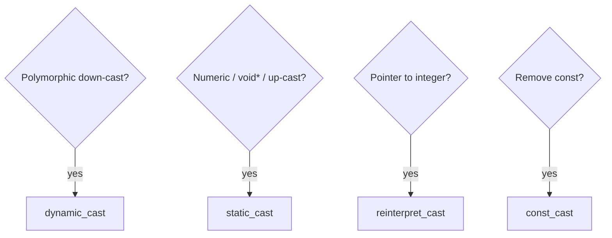

# CPP06 — Exercise breakdown

## How module validation works

| Status | Meaning |
|--------|---------|
| **Mandatory** | Required for **100/100** on CPP06. |
| **Bonus** | Not present in CPP06 — all listed exercises are mandatory. |

CPP06 has **3 mandatory exercises** (ex00–ex02). Each is evaluated independently in its own folder.

---

## Module concepts — four casts and RTTI

| Cast | When | Fails how |
|------|------|-----------|
| `static_cast` | Compile-time-known conversions; up-cast; numeric casts | Undefined if misuse (e.g. bad down-cast) |
| `dynamic_cast` | Polymorphic down-cast / type id | `nullptr` (pointer) or `std::bad_cast` (reference) |
| `reinterpret_cast` | Pointer↔integer, unrelated pointer types | Implementation-defined; very unsafe |
| `const_cast` | Add/remove const/volatile | Modifying truly const data = UB |

**Rule:** Prefer the most restrictive cast that expresses intent. No C-style `(type)value` in new code.

| Exercise | Cast focus |
|----------|------------|
| ex00 | `static_cast` between scalar types after parsing |
| ex01 | `reinterpret_cast` pointer ↔ `uintptr_t` |
| ex02 | `dynamic_cast` + **RTTI** (Runtime Type Information) |

**RTTI** lets you inspect the dynamic type of a polymorphic object at runtime. It requires a **polymorphic base** (at least one virtual function — typically a virtual destructor). `dynamic_cast` is the safe down-cast; pointer form returns `nullptr` on failure, reference form throws `std::bad_cast`.



---

## ex00 — Conversion of scalar types

| | |
|---|---|
| **Mandatory** | Yes |
| **Turn-in** | `ex00/` |
| **Files** | `Makefile`, `main.cpp`, `ScalarConverter.{h,hpp,cpp}` |
| **Binary name** | Often `convert` |

### Concepts

- Parse one CLI literal as **char**, **int**, **float**, or **double** (detection order per subject).
- **Type detection:** char = single printable character; int = integer syntax (optional sign, no decimal); float = `f` suffix or decimal rules per subject; double = floating syntax without `f`.
- **Special floats:** `nan`/`nanf`, `inf`/`inff`, `+inf`, `-inf`, etc. — char/int → `impossible`; float → `nanf`/`inff`; double → `nan`/`inf`.
- **`static_cast` chain** after parsing primary type: e.g. `static_cast<int>(parsedDouble)`, `static_cast<float>(parsedInt)`, `static_cast<char>(i)` only after range check.
- Parsing helpers: `std::strtod`, `std::strtol`, or `std::stod`/`std::stoi` with careful validation.

### Requirements

| Requirement | Detail |
|-------------|--------|
| Input | One literal argument |
| Output | Four lines: `char:`, `int:`, `float:`, `double:` |
| Char display | Printable → character; control chars → `Non displayable`; out of range → `impossible` |
| Int display | Decimal or `impossible` (overflow, nan, inf) |
| Float display | Always show decimal; add `f`; whole numbers still show `.0f` |
| Double display | Show `.0` for whole numbers |
| Casts | **`static_cast`** only for scalar conversions — no C-style casts |
| Pseudo-literals | Detect `nan`, `nanf`, `+inf`, `-inf`, `+inff`, `-inff`, etc. |

Example:

```bash
./convert 42
# char: '*'
# int: 42
# float: 42.0f
# double: 42.0
```

| Input family | float output | double output |
|--------------|--------------|---------------|
| `nan` / `nanf` | `nanf` | `nan` |
| `inf` / `inff` | `inff` | `inf` |

### Pitfalls & evaluator checks

- Char from 256+ → `impossible`; float formatting off by one decimal; accepting invalid mixed syntax.
- Evaluator tests: int, float, char, double, nan, inf; output format exactly as subject; edge cases 0, 256, negative numbers.

---

## ex01 — Serialization

| | |
|---|---|
| **Mandatory** | Yes |
| **Turn-in** | `ex01/` |
| **Files** | `Makefile`, `main.cpp`, `Serializer.{h,hpp,cpp}`, `Data.hpp` |

### Concepts

- **Serialization here** = pointer → integer → pointer (not network serialization).
- **`uintptr_t`** (`<cstdint>`): unsigned integer wide enough to hold any data pointer — do not use `long` (may truncate).
- **`reinterpret_cast`** preserves bit pattern; only valid in the **same address space during the same run** (not across processes, not after `delete`).

```cpp
uintptr_t serialize(Data* ptr) {
    return reinterpret_cast<uintptr_t>(ptr);
}
Data* deserialize(uintptr_t raw) {
    return reinterpret_cast<Data*>(raw);
}
```

### Requirements

| Requirement | Detail |
|-------------|--------|
| API | `uintptr_t serialize(Data* ptr);` and `Data* deserialize(uintptr_t raw);` |
| `serialize` | **`reinterpret_cast`** to `uintptr_t` |
| `deserialize` | Convert back to `Data*` |
| `Data` struct | At least one member (e.g. `int`, `std::string`) |
| `main` | Proves original and deserialized pointers equal and data intact |

### Pitfalls & evaluator checks

- Using `long` instead of `uintptr_t`; assuming round-trip works after `delete` or in another process.
- Evaluator checks round-trip preserves address and data; asks when `reinterpret_cast` is valid.

---

## ex02 — Identify real type

| | |
|---|---|
| **Mandatory** | Yes |
| **Turn-in** | `ex02/` |
| **Files** | `Makefile`, `main.cpp`, `Base.{h,hpp,cpp}`, `A.hpp`, `B.hpp`, `C.hpp` |

### Concepts

- **Polymorphic `Base`** — virtual destructor minimum; without it, `dynamic_cast` fails at compile time:

```cpp
class Base {
public:
    virtual ~Base();
};
```

- **`A`, `B`, `C`:** empty derived classes.
- **Pointer `identify`:** `dynamic_cast<A*>(p)` — failed cast → `nullptr` (no exception); chain if/else.
- **Reference `identify`:** **no if/else chains** — try/catch with `dynamic_cast` to reference; failure throws `std::bad_cast`.
- **`generate()`:** `switch (std::rand() % 3)` returning `new A()`, `new B()`, or `new C()`; seed RNG once in `main`.

```cpp
if (dynamic_cast<A*>(p))
    std::cout << "A\n";
else if (dynamic_cast<B*>(p))
    std::cout << "B\n";
else
    std::cout << "C\n";

try {
    (void)dynamic_cast<A&>(p);
    std::cout << "A\n";
    return;
} catch (std::bad_cast&) {}
// repeat for B; else C
```

### Requirements

| Requirement | Detail |
|-------------|--------|
| `generate()` | Randomly returns `new A()`, `new B()`, or `new C()` |
| `identify(Base*)` | Print `A`, `B`, or `C` via pointer `dynamic_cast` |
| `identify(Base&)` | Same output via reference `dynamic_cast` + try/catch — **no if/else** on types |
| Polymorphism | Virtual destructor on `Base` |
| Memory | `delete` generated object in `main` — no leaks |

### Pitfalls & evaluator checks

- Non-polymorphic `Base`; using if/else on references (forbidden by subject spirit); memory leaks.
- Evaluator runs many iterations for correct identification; verifies reference version uses try/catch; confirms cleanup in `main`.

---

## Module checklist

- [ ] Three exercises, each compiles independently
- [ ] C++ casts only (no `(type)` C-style)
- [ ] No STL containers
- [ ] `-std=c++20 -Wall -Wextra -Werror`
- [ ] Can explain: why C-style casts are discouraged; pointer vs reference `dynamic_cast`; when `reinterpret_cast` is justified here; what enables RTTI
