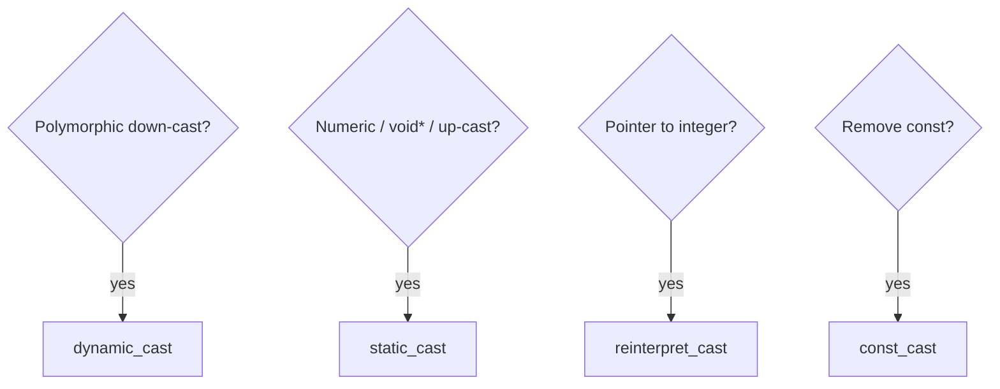

# CPP06 — Theory and concepts

## Module-wide: the four casts

| Cast | When | Fails how |
|------|------|-----------|
| `static_cast` | Compile-time-known conversions; up-cast; numeric casts | Undefined if misuse (e.g. bad down-cast) |
| `dynamic_cast` | Polymorphic down-cast / type id | `nullptr` (pointer) or `std::bad_cast` (reference) |
| `reinterpret_cast` | Pointer↔integer, unrelated pointer types | Implementation-defined; very unsafe |
| `const_cast` | Add/remove const/volatile | Modifying truly const data = UB |

**Rule:** Prefer the most restrictive cast that expresses intent.

---

## ex00 — Scalar conversion

### Objective

Convert one string literal to all scalar types and print formatted results.

### Type detection logic

1. **Char:** single printable character (length 1, not digit-only edge cases per subject)
2. **Int:** integer syntax (optional sign, no decimal)
3. **Float:** contains `f` suffix or decimal point rules per subject
4. **Double:** floating syntax without `f`

### Special floating values

| Input family | float output | double output |
|--------------|--------------|---------------|
| `nan` / `nanf` | `nanf` | `nan` |
| `inf` / `inff` | `inff` | `inf` |

Use `std::strtod`, `std::strtol`, or `std::stod` / `std::stoi` (C++11+) with careful validation.

### Display rules

- **char:** printable → character; control chars → `Non displayable`; out of range → `impossible`
- **int:** decimal or `impossible` (overflow, nan, inf)
- **float:** always show decimal; add `f`; whole numbers still show `.0f`
- **double:** show `.0` for whole numbers

### `static_cast` role

Chain conversions after parsing primary type:

```cpp
int i = static_cast<int>(parsedDouble);
float f = static_cast<float>(parsedInt);
char c = static_cast<char>(i);  // check range first
```

### Pitfalls

- Char from 256+ → `impossible`
- Float formatting off by one decimal
- Accepting invalid mixed syntax

---

## ex01 — Serialization

### Objective

Store a pointer value as an integer and restore it — demonstrates `reinterpret_cast`.

### Required API

```cpp
uintptr_t serialize(Data* ptr);
Data*     deserialize(uintptr_t raw);
```

### Concepts

- **`uintptr_t`** (`<cstdint>`): unsigned integer wide enough to hold any data pointer
- **Serialization here** = pointer → integer → pointer (not network serialization)
- **Validity:** Only safe in the same address space during the same run

### Implementation pattern

```cpp
uintptr_t serialize(Data* ptr) {
    return reinterpret_cast<uintptr_t>(ptr);
}
Data* deserialize(uintptr_t raw) {
    return reinterpret_cast<Data*>(raw);
}
```

### Pitfalls

- Using `long` instead of `uintptr_t` (may truncate on some platforms)
- Thinking this works across processes or after `delete`

---

## ex02 — Identify real type (RTTI)

### Objective

Identify whether a `Base*` or `Base&` actually refers to `A`, `B`, or `C`.

### Polymorphism requirement

`Base` **must** have at least one virtual function — typically:

```cpp
class Base {
public:
    virtual ~Base();
};
```

Without this, `dynamic_cast` fails at compile time.

### Pointer identification

```cpp
if (dynamic_cast<A*>(p))
    std::cout << "A\n";
else if (dynamic_cast<B*>(p))
    std::cout << "B\n";
else
    std::cout << "C\n";
```

Failed cast → `nullptr` (no exception).

### Reference identification (subject constraint)

**No if/else chains** — use try/catch with `dynamic_cast` to reference:

```cpp
try {
    (void)dynamic_cast<A&>(p);
    std::cout << "A\n";
    return;
} catch (std::bad_cast&) {}
// repeat for B; else C
```

### `generate()`

```cpp
switch (std::rand() % 3) {
    case 0: return new A();
    case 1: return new B();
    default: return new C();
}
```

Seed RNG in `main` once.

### Pitfalls

- Non-polymorphic `Base`
- Memory leak: `delete` generated object in `main`
- Using if/else on references in ex02 (forbidden by subject spirit)

---

## Cast decision flowchart



---

## Evaluation rehearsal

1. Why is C-style cast discouraged?
2. Difference between `dynamic_cast` on pointer vs reference?
3. When is `reinterpret_cast` justified in this module?
4. What is RTTI and what enables it?
