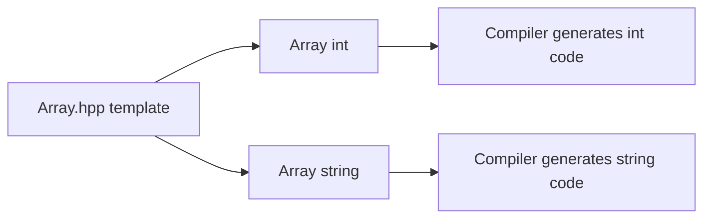

# CPP07 — Exercise breakdown

## How module validation works

| Status | Meaning |
|--------|---------|
| **Mandatory** | Required for **100/100** on CPP07. |
| **Bonus** | None in this module. |

CPP07 has **3 mandatory exercises** (ex00–ex02). Each is evaluated independently in its own `exXX/` directory.

---

## Module concepts

### Templates

Templates are **compile-time parameterized code**. The compiler generates concrete functions or classes for each type used at instantiation.

```cpp
template<typename T>
T min(T const& a, T const& b) {
    return (a < b) ? a : b;
}
```

`T` must support every operation used in the body (`operator<` for `min`).

### Why headers?

Template definitions must be visible at the point of instantiation — typically the entire template lives in a `.hpp` or an included `.tpp` file. Putting template bodies in a separate `.cpp` causes link errors when other translation units instantiate the template.

### Type requirements (constraints)

Without C++20 concepts, requirements are **implicit**: if `T` lacks `operator<`, compilation fails at instantiation, not at the template definition line.

### Type deduction

For function templates, the compiler deduces `T` from arguments. Both arguments must be the **same type** unless you specify `T` explicitly:

```cpp
min(1, 2);           // OK — T = int
min(1, 2.0);         // Error — conflicting deduction
min<int>(1, 2.0);    // Explicit T — may narrow
```

### Template instantiation



Each `(template, T)` pair generates separate object code at compile time.

---

## ex00 — Start with a few functions

| | |
|---|---|
| **Mandatory** | Yes |
| **Turn-in** | `ex00/` |
| **Files** | `Makefile`, `main.cpp`, `whatever.hpp` (or subject name) |

### Concepts

Three **function templates** — `swap`, `min`, `max` — introduce generic programming without classes. `swap` needs non-const references to modify values; `min`/`max` take `const T&` to avoid unnecessary copies. Deduction requires both operands share the same type.

### Requirements

| Requirement | Detail |
|-------------|--------|
| `swap(T& a, T& b)` | Exchange two values of the same type |
| `min(T const& a, T const& b)` | Return lesser value via `operator<` |
| `max(T const& a, T const& b)` | Return greater value via `operator>` |
| Header placement | All templates in a **header** file (`.hpp`) |
| `main` | Demonstrate correct results with at least `int` and `std::string` |
| Compilation | Template compiles only when `T` supports required operators |

### Pitfalls & evaluator checks

- **Pitfalls:** Passing `min`/`max` arguments by value (unnecessary copies); mixing types without explicit `T`; putting template bodies in `.cpp`
- **Evaluator:** Correct results in `main` for `int` and `string`; template fails to compile when type lacks `operator<`

---

## ex01 — Iter

| | |
|---|---|
| **Mandatory** | Yes |
| **Turn-in** | `ex01/` |
| **Files** | `Makefile`, `main.cpp`, `iter.hpp` |

### Concepts

A **higher-order template** that takes a raw array (`T*` + length) and applies a callable to each element in order. Replaces `std::vector` iteration without STL containers. Array decay: `T*` plus `length` is the C-style array model.

```cpp
template<typename T>
void iter(T* array, size_t length, void (*func)(T&));
```

Alternative (confirm with subject): template callable parameter `template<typename T, typename F> void iter(T*, size_t, F func)`.

### Requirements

| Requirement | Detail |
|-------------|--------|
| Signature | `iter(T* array, size_t length, void (*f)(T&))` (or template callable variant) |
| Iteration | Walk `length` elements starting at `array`; call `f` on each in order |
| `main` — print | Demonstrate a function that prints each element |
| `main` — mutate | Demonstrate a function that modifies elements (e.g. increment) |
| Types | Works on different types (`int`, `std::string`, etc.) |
| Bounds | No out-of-bounds access |

### Pitfalls & evaluator checks

- **Pitfalls:** Off-by-one on `length`; wrong callback signature (`void (*)(T const&)` vs `void (*)(T&)`); using STL containers instead of raw array
- **Evaluator:** Array modified after iter with increment; print output correct; no array bounds errors

---

## ex02 — Array

| | |
|---|---|
| **Mandatory** | Yes |
| **Turn-in** | `ex02/` |
| **Files** | `Makefile`, `main.cpp`, `Array.hpp` (+ optional `Array.tpp`) |

### Concepts

A **class template** wrapping a dynamic array with bounds checking. Sized constructor uses `new T[n]()` — value-initializes each element. Empty constructor sets `_size = 0` and `_array = nullptr`. Standard OCF applies (no `const` members blocking reassignment). If `new T[n]` throws `std::bad_alloc`, RAII in the constructor body prevents leaks.

### Requirements

| Requirement | Detail |
|-------------|--------|
| `Array()` | Empty array — size 0, null or equivalent pointer |
| `Array(unsigned int n)` | Allocate `n` default-constructed elements via `new T[n]()` |
| OCF | Copy constructor and copy assignment perform **deep copy**; destructor releases buffer |
| `operator[](unsigned int index)` | Non-const access; throws `OutOfBoundsException` when `index >= size()` |
| `operator[](unsigned int index) const` | Const overload required |
| `size()` | Returns element count as `unsigned int` |
| `OutOfBoundsException` | Nested class inheriting `std::exception` with `what()` |
| Storage | Raw `new[]` / `delete[]` — **no STL `vector`** |
| `Array<int> a(5)` | Five value-initialized ints |
| `a[2] = 42` | In-bounds access succeeds |
| `a[99]` | Throws `OutOfBoundsException` |
| Copy / assign | Independent deep copy — modify copy, original unchanged |
| `main` | Demonstrate construction, access, copy, exception handling |

### Pitfalls & evaluator checks

- **Pitfalls:** Shallow copy → double free; forgetting const overload of `operator[]`; missing `what()` on exception; using `vector` internally
- **Evaluator:** Deep copy verified (modify copy, original unchanged); exception thrown and catchable; no leaks (Valgrind)

---

## Module checklist

- [ ] All templates in headers (or included `.tpp`)
- [ ] No STL containers in implementations
- [ ] Three separate `exXX/` directories
- [ ] `-std=c++20 -Wall -Wextra -Werror`

### Evaluation topics to rehearse

Be ready to explain without notes:

1. Difference between template specialization and overloading
2. Why templates must be in headers
3. What happens when `Array<SomeClassWithoutDefaultCtor>` is used
4. Deep vs shallow copy in templates
