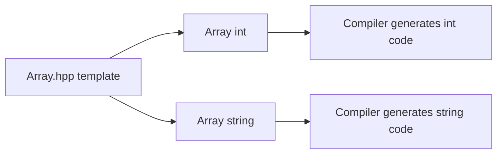

# CPP07 — Theory and concepts

## Module-wide: templates

Templates are **compile-time parameterized code**. The compiler generates concrete functions/classes per type used.

```cpp
template<typename T>
T min(T const& a, T const& b) {
    return (a < b) ? a : b;
}
```

`T` must support any operation used in the body (`operator<` for `min`).

### Why headers?

Template definitions must be visible at the point of instantiation — typically entire template in `.hpp` or included `.tpp`.

### Type requirements (constraints)

Without C++20 concepts, requirements are implicit: if `T` lacks `operator<`, compilation fails at instantiation.

---

## ex00 — Function templates

### Functions

| Name | Behavior |
|------|----------|
| `swap` | Exchange two values |
| `min` | Return lesser (by `operator<`) |
| `max` | Return greater |

### Pass by reference

- `swap` needs non-const references to modify
- `min`/`max` should take `const T&` to avoid copies

### Deduction rules

Both arguments must be the **same type**:

```cpp
min(1, 2);           // OK — T = int
min(1, 2.0);         // Error — conflicting deduction
min<int>(1, 2.0);    // Explicit T — may narrow
```

---

## ex01 — iter

### Signature (typical)

```cpp
template<typename T>
void iter(T* array, size_t length, void (*func)(T&));
```

Or with function object / template callback:

```cpp
template<typename T, typename F>
void iter(T* array, size_t length, F func);
```

### Concepts

- **Higher-order template:** takes a function pointer or callable
- **Array decay:** `T*` + length replaces `std::vector`
- Apply `func` to each element in order

### Use cases in tests

- Print each element
- Mutate each element (increment)

---

## ex02 — Array class template

### Interface (subject)

```cpp
template<typename T>
class Array {
public:
    Array();
    Array(unsigned int n);
    Array(const Array& other);
    Array& operator=(const Array& other);
    ~Array();

    T& operator[](unsigned int index);
    const T& operator[](unsigned int index) const;
    unsigned int size() const;

    class OutOfBoundsException : public std::exception { /* what() */ };
};
```

### Memory model

- Sized ctor: `new T[n]()` — value-initializes each element
- Empty ctor: `_size = 0`, `_array = nullptr` (or equivalent)
- Deep copy: allocate new buffer, copy elements

### Assignment challenges

`Array` has no `const` members blocking reassignment — standard OCF applies.

### Exception safety

If `new T[n]` throws `std::bad_alloc`, object should not leak (RAII in ctor body).

### Pitfalls

- Shallow copy → double free
- Forgetting const overload of `operator[]`
- `unsigned int` index vs negative (not an issue with unsigned param)

---

## Template instantiation diagram



---

## Evaluation topics

1. Difference between template specialization and overloading
2. Why templates must be in headers
3. What happens when `Array<SomeClassWithoutDefaultCtor>` is used
4. Deep vs shallow copy in templates
