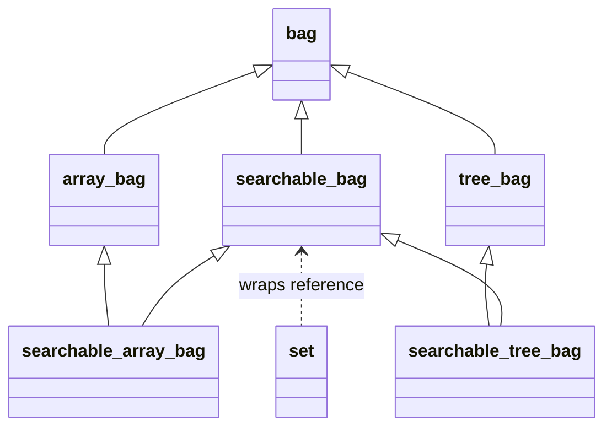

# polyset — Implementation walkthrough

Study guide for the Exam Rank 05 **polyset** exercise. Hardest level-00 question — inheritance, virtual base classes, and a thin wrapper.

## Architecture overview



Given abstract classes:

```cpp
// bag.hpp
class bag {
public:
    virtual void insert(int) = 0;
    virtual void insert(int *, int) = 0;
    virtual void print() const = 0;
    virtual void clear() = 0;
};

// searchable_bag.hpp
class searchable_bag : virtual public bag {
public:
    virtual bool has(int) const = 0;
};
```

`array_bag` and `tree_bag` already inherit `virtual public bag` (diamond-safe). Your searchable classes inherit **both** the concrete bag and `searchable_bag`.

---

## Part 1 — `searchable_array_bag`

### Header (provided skeleton)

```cpp
class searchable_array_bag : public searchable_bag, public array_bag {
public:
    searchable_array_bag() {}
    searchable_array_bag(const searchable_array_bag &other) : array_bag(other) {}
    searchable_array_bag &operator=(const searchable_array_bag &other);
    bool has(int value) const;
};
```

### `has(int) const`

`array_bag` exposes protected `data` (int pointer) and `size`:

```cpp
bool searchable_array_bag::has(int value) const {
    for (int i = 0; i < size; ++i)
        if (data[i] == value)
            return true;
    return false;
}
```

### `operator=`

Copy the `array_bag` subobject:

```cpp
searchable_array_bag &searchable_array_bag::operator=(const searchable_array_bag &other) {
    if (this != &other)
        array_bag::operator=(other);
    return *this;
}
```

No extra state in searchable layer — `insert`, `print`, `clear` come from `array_bag`.

---

## Part 1 — `searchable_tree_bag`

### Header (provided skeleton)

```cpp
class searchable_tree_bag : public searchable_bag, public tree_bag {
public:
    searchable_tree_bag() {}
    searchable_tree_bag(const searchable_tree_bag &other) : tree_bag(other) {}
    searchable_tree_bag &operator=(const searchable_tree_bag &other);
    bool has(int value) const;
};
```

### `has(int) const`

`tree_bag` exposes protected `tree` pointer to a BST node:

```cpp
struct node { node *l; node *r; int value; };
```

Recursive search:

```cpp
static bool search_node(tree_bag::node *n, int value) {
    if (!n) return false;
    if (n->value == value) return true;
    if (value < n->value) return search_node(n->l, value);
    return search_node(n->r, value);
}

bool searchable_tree_bag::has(int value) const {
    return search_node(tree, value);
}
```

### `operator=`

```cpp
searchable_tree_bag &searchable_tree_bag::operator=(const searchable_tree_bag &other) {
    if (this != &other)
        tree_bag::operator=(other);
    return *this;
}
```

---

## Part 2 — `set`

Wraps a **reference** to an existing `searchable_bag` and enforces set semantics (no duplicates).

### Header (provided skeleton)

```cpp
class set {
public:
    set(searchable_bag &bag) : _bag(bag) {}
    bool has(int value);
    void insert(int value);
    void insert(int *arr, int size);
    void print() const;
    void clear();
    const searchable_bag &get_bag() const;
private:
    searchable_bag &_bag;
};
```

### Implementation logic

| Method | Behaviour |
|--------|-----------|
| `has(v)` | `return _bag.has(v);` |
| `insert(v)` | **Only if** `!_bag.has(v)` → `_bag.insert(v);` |
| `insert(arr, n)` | For each element, call `insert(single)` |
| `print()` | `_bag.print();` |
| `clear()` | `_bag.clear();` |
| `get_bag()` | `return _bag;` |

The set does **not** own the bag — it delegates. Deduplication is the only added logic.

---

## Given main — what it tests

```cpp
searchable_bag *t = new searchable_tree_bag;
searchable_bag *a = new searchable_array_bag;
// insert argv values, print both bags
// has(argv[i]) and has(argv[i]-1) on each
// clear both
// copy construct searchable_array_bag from cleared *a
// set sa(*a); set st(*t);
// insert argv through set — duplicates ignored
// sa.print(), sa.get_bag().print(), st.print()
// sa.clear(); sa.insert array {1,2,3,4}
```

Run example:

```bash
./polyset 1 2 3 2
```

Expect `has(2)` true, `has(1)` false for `argv[i]-1` when appropriate.

---

## Orthodox canonical form

Subject: *"All classes should be under orthodox canonical form."*

| Class | Default ctor | Copy ctor | Copy assign | Dtor |
|-------|--------------|-----------|-------------|------|
| `searchable_array_bag` | yes (given) | yes (given) | **you write** | inherited from base dtor |
| `searchable_tree_bag` | yes | yes | **you write** | inherited |
| `set` | N/A (ref wrapper) | usually not required | — | trivial |

If compiler warns about missing virtual destructor on `bag` — given code; not your job to fix.

---

## Diamond inheritance — why `virtual`

Without `virtual public bag`, `searchable_array_bag` would contain **two** `bag` subobjects (one via `searchable_bag`, one via `array_bag`). The given headers already use `virtual public bag` on `array_bag`, `tree_bag`, and `searchable_bag`. **Do not remove `virtual`.**

---

## Pitfalls

| Bug | Symptom |
|-----|---------|
| `set::insert` always calls `_bag.insert` | Duplicates in output |
| `has` not `const` | Given main / pointer calls fail |
| Wrong BST search direction | `has` false on existing values |
| `operator=` shallow-copies tree | Double-free or leaked nodes |
| Modifying given files | Exam rejects or wrong interface |
| Typo `searchable_tree_bg.cpp` in subject | Actual file is `searchable_tree_bag.cpp` |

---

## Build & test

Compile all given + your files:

```bash
c++ -Wall -Wextra -Werror -std=c++98 \
  array_bag.cpp tree_bag.cpp \
  searchable_array_bag.cpp searchable_tree_bag.cpp \
  set.cpp main.cpp -o polyset_test
./polyset_test 5 3 5 1
```

---

## Bag vs set (concept)

| | Bag | Set |
|---|-----|-----|
| Duplicates | Allowed | Rejected on insert |
| `has()` | searchable bags only | Delegates to wrapped bag |
| Underlying | Array or BST | Same structure, filtered inserts |

Read `shame.en.txt` in the exam directory if bag/set terminology is unfamiliar.

---

## Timed drill target

~90–120 minutes. Implement `searchable_array_bag` first (easier), then `set`, then `searchable_tree_bag`.
