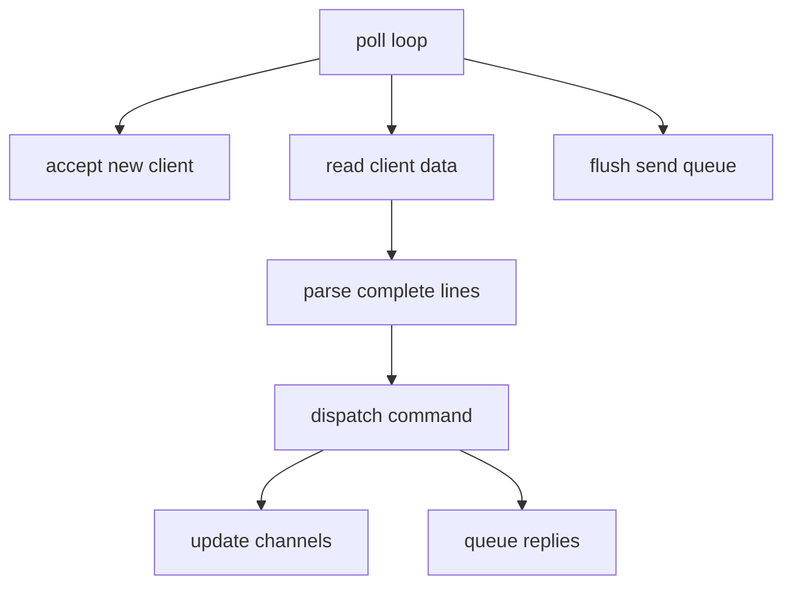
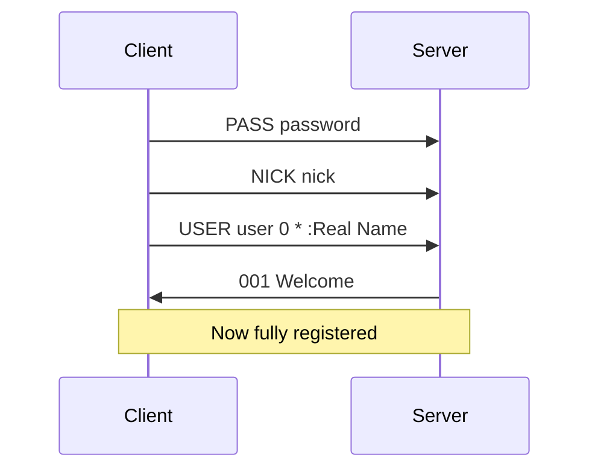

# IRC — Exercise breakdown (ft_irc v9.1)

Source: [ft_irc.pdf](./ft_irc.pdf) (subject v9.1). When the PDF and campus norms differ, **the PDF and evaluation sheet win**.

---

## How project validation works

ft_irc is a **single mandatory project** — there are no optional exercises. Bonus features are graded only if mandatory is **perfect**.

| | |
|---|---|
| **Program name** | `ircserv` |
| **Run** | `./ircserv <port> <password>` |
| **Files** | `Makefile`, `*.{h,hpp}`, `*.cpp`, `*.tpp`, `*.ipp`, optional config file |
| **Makefile rules** | `$(NAME)`, `all`, `clean`, `fclean`, `re` — no unnecessary relinking |
| **Libft** | Not applicable |
| **External libs / Boost** | Forbidden |

### C++ standard

The subject PDF requires **C++98** (`-std=c++98`). The Hive campus norm for CPP modules is **C++20**. Confirm with your evaluation sheet which flag evaluators use. Safe approach: write code that compiles cleanly with **both** `-std=c++98` and `-std=c++20` until you know otherwise.

---

## Module concepts

### IRC protocol overview

IRC is a **text-based**, line-oriented protocol over TCP. Each message ends with `\r\n`.

**Message structure:**

```text
[:prefix] COMMAND [param [param ...]] [:trailing]\r\n
```

Examples:

```text
PASS secret\r\n
NICK alice\r\n
USER alice 0 * :Alice User\r\n
JOIN #general\r\n
PRIVMSG #general :Hello everyone\r\n
```

### Reply numerics

Server responds with 3-digit codes:

| Code | Meaning |
|------|---------|
| 001 | Welcome (RPL_WELCOME) |
| 433 | Nickname in use |
| 401 | No such nick/channel |
| 482 | Not channel operator |
| 475 | Cannot join (bad key) |

Reference clients depend on correct numerics during registration — study RFC 2812 numeric list.

### Event-driven model



### Core objects

**Server** — listening socket fd; `std::map<int, Client>` or `vector<Client>` keyed by fd; `std::map<std::string, Channel>` by channel name; password; main `poll()` loop.

**Client:**

| Field | Purpose |
|-------|---------|
| fd | Socket |
| nickname, username | Identity after registration |
| registered | Passed PASS+NICK+USER |
| readBuffer | Incomplete input |
| sendQueue | Pending output |
| channels | Membership set |

**Channel:**

| Field | Purpose |
|-------|---------|
| name | e.g. `#general` |
| topic | Channel topic string |
| members | Clients in channel |
| operators | Subset with privileges |
| modes | `i`, `t`, `k`, `o`, `l` state + key + limit |

### RFC reading order

1. [RFC 2812](https://www.rfc-editor.org/rfc/rfc2812) — message format, core commands
2. [RFC 1459](https://www.rfc-editor.org/rfc/rfc1459) — historical reference, mode details

Do not implement server-to-server (RFC 2813) — out of scope.

---

## Architecture & event loop

### Concepts

With one thread and one `poll()`, no client can block the whole server waiting on `recv`. Every socket is `O_NONBLOCK`; partial reads are normal.

**Read buffering** — TCP is a byte stream; one `recv` may contain half a message or multiple messages:

```text
Buffer: "PRIVMSG #foo :hel"
Buffer: "PRIVMSG #foo :hello\r\nJOIN #bar\r\n"
```

Split on `\r\n`, process complete lines only.

**Write buffering** — If `send` returns `EAGAIN`, queue remaining bytes and wait for `POLLOUT`.

**Subject partial-data test** — aggregate fragmented TCP data before parsing:

```bash
nc -C 127.0.0.1 6667
```

Send a command in fragments with Ctrl+D (`com`, then `man`, then `d` + newline). The server must rebuild the full line before dispatching.

### Requirements

| Requirement | Detail |
|-------------|--------|
| Multiple clients | Handle many simultaneous connections without hanging |
| No `fork()` | Single process only |
| Non-blocking I/O | **All** file descriptors non-blocking |
| One multiplexer | **Exactly one** `poll()` (or `select` / `kqueue` / `epoll`) for **all** fds — listen, read, write |
| TCP/IP | IPv4 or IPv6 |
| Reference client | Pick one real client (Irssi, HexChat, WeeChat, …); it must connect **without errors** during eval |
| No IRC client | Do not implement your own client |
| No server-to-server | Do not implement IRC network linking (RFC 2813) |

### Pitfalls & evaluator checks

| Pitfall | Evaluator check |
|---------|-----------------|
| I/O without `poll()` | Subject: grade **0** — every `read`/`recv`/`write`/`send` on client/listen sockets must go through the event loop |
| Blocking `recv` | One slow client freezes server |
| No send buffer | Lost messages on `EAGAIN`; need send queue + `POLLOUT` |
| Partial TCP reads | `nc -C` split test fails |
| Server crash on edge case | Subject: grade **0** — must not crash or quit unexpectedly, even on OOM |
| More than one multiplexer pattern | Violates "only 1 poll()" rule |

---

## Registration & authentication

### Concepts



- Wrong `PASS` → disconnect or error numerics
- Duplicate `NICK` → `433` and request new nick
- Commands like `JOIN` before registration → error

### Requirements

| Command | Role |
|---------|------|
| `PASS` | Authenticate with server password |
| `NICK` | Set/display nickname |
| `USER` | Register user identity |

| Capability (subject) | Maps to |
|----------------------|---------|
| Authenticate | `PASS` |
| Set nickname | `NICK` |
| Set username | `USER` |

### Pitfalls & evaluator checks

| Pitfall | Evaluator check |
|---------|-----------------|
| Missing welcome numerics | Client disconnects at registration — send `001` after PASS+NICK+USER |
| Wrong password accepted | `PASS` with bad password must be rejected |
| Nick collision not handled | Duplicate `NICK` → `433` |

---

## Channels & messaging

### Concepts

**Broadcasting** — when client sends `PRIVMSG #channel :text`:

1. Verify sender is in channel
2. Build `:nick!user@host PRIVMSG #channel :text\r\n`
3. Send to every **other** member in channel (match reference client behavior on echo)

Target forms: `#channel` (broadcast) or `nickname` (direct message).

### Requirements

| Command | Role |
|---------|------|
| `JOIN` | Enter channel (`#name`); create if missing |
| `PRIVMSG` | Private or channel message |

| Capability (subject) | Detail |
|----------------------|--------|
| Join a channel | `JOIN` |
| Send/receive private messages | `PRIVMSG` (user and `#channel` targets) |
| Channel broadcast | Forward channel `PRIVMSG` to **every other** member in that channel |

### Pitfalls & evaluator checks

| Pitfall | Evaluator check |
|---------|-----------------|
| Wrong line endings | Client hangs — use `\r\n` |
| Nick not updated on channel relay | Wrong prefix in messages |
| Channel message not reaching others | `PRIVMSG` to channel must reach every other member |
| DM broken | `PRIVMSG` to nickname must work |

---

## Operator commands & channel modes

### Concepts

Operators vs regular users — track channel operators; enforce privileges on operator-only commands.

**Channel modes** — parsing `MODE` is notoriously fiddly; parameter order matters per mode.

Examples:

```text
MODE #chan +i
MODE #chan +k secret
MODE #chan +l 10
MODE #chan +o alice
```

### Requirements

| Command | Role |
|---------|------|
| `KICK` | Remove user from channel |
| `INVITE` | Invite user to `+i` channel |
| `TOPIC` | View or set topic |
| `MODE` | View/set channel modes |

| Mode | Flag | Effect |
|------|------|--------|
| invite-only | `i` | Only invited users may `JOIN` |
| topic restricted | `t` | Only operators set `TOPIC` |
| channel key | `k` | Password required to join |
| operator | `o` | Grant/remove operator to user |
| user limit | `l` | Max members |

### Pitfalls & evaluator checks

| Pitfall | Evaluator check |
|---------|-----------------|
| Mode parsing bugs | `+ok` vs `+o nick` confusion |
| `+i` without invite flow | `INVITE` required before `JOIN` |
| `+k` without key check | Bad key → `475` |
| `+t` not enforced | Non-operators cannot set `TOPIC` |
| `+l` not enforced | Channel respects member limit |
| Not channel operator | `482` on unauthorized operator commands |

---

## Practical extras (not in subject PDF)

### Concepts

The PDF names **capabilities**, not every IRC command. If your chosen reference client errors on any of these during a normal session, implement a minimal handler or numeric reply.

### Requirements

| Command | In subject PDF? | Practical need |
|---------|------------------|----------------|
| `PASS` / `NICK` / `USER` | Implied | Required |
| `JOIN` / `PRIVMSG` | Implied | Required |
| `KICK` / `INVITE` / `TOPIC` / `MODE` | Explicit | Required |
| `PING` / `PONG` | Not listed | Almost always needed — clients disconnect without `PONG` |
| `PART` / `QUIT` | Not listed | Expected in normal client use |
| `NOTICE` | Not listed | Optional unless client sends it |
| `NAMES` / `LIST` / `WHO` | Not listed | May be needed for channel user lists in GUI clients |

### Pitfalls & evaluator checks

| Pitfall | Evaluator check |
|---------|-----------------|
| No `PONG` reply | Client times out and disconnects |
| Reference client protocol errors | Session must complete without errors in your chosen client |

---

## Bonus

| Bonus | Subject mention |
|-------|-----------------|
| File transfer | DCC or similar |
| Bot | Automated responder |

**Bonus is only graded if mandatory is PERFECT** — all mandatory requirements work without malfunction. Incomplete mandatory = bonus not evaluated.

---

## Module checklist

- [ ] `./ircserv <port> <password>` — exactly two arguments after binary name
- [ ] Builds with `-Wall -Wextra -Werror` and subject standard flag
- [ ] Makefile: `NAME`, `all`, `clean`, `fclean`, `re`; no spurious relinking
- [ ] Single process, no `fork()`
- [ ] All sockets non-blocking
- [ ] One `poll()` (or approved equivalent) drives **all** I/O
- [ ] Partial reads/writes handled; per-client read buffer until `\r\n`
- [ ] Send queue + `POLLOUT` when `send` returns `EAGAIN`
- [ ] `PASS` / wrong password rejected
- [ ] `NICK` + `USER` + welcome numerics — client shows registered state
- [ ] `JOIN` channel; `PRIVMSG` to channel reaches other members
- [ ] `PRIVMSG` to nickname (DM) works
- [ ] Operator: `KICK`, `INVITE`, `TOPIC`, `MODE` with `i`, `t`, `k`, `o`, `l`
- [ ] Mode rules enforced (`+i` needs invite, `+k` needs key, `+t` restricts topic, `+l` limits members)
- [ ] Reference client session has no protocol errors
- [ ] No leaks on connect/disconnect cycles (valgrind)
- [ ] Server survives edge cases without crash
- [ ] Partial-data `nc -C` test passes

### MacOS-only rule

On macOS, `write()` behaves differently. You may use `fcntl()` **only** as:

```cpp
fcntl(fd, F_SETFL, O_NONBLOCK);
```

Any other `fcntl` flag is forbidden on macOS.

### Allowed external functions

See authoritative list in [syntax-libraries-tools.md](./syntax-libraries-tools.md). Anything not on that list (or not in the C++ standard library) needs explicit subject approval.

### Evaluation topics to rehearse

Be ready to demonstrate live:

1. Start server: `./ircserv 6667 mypass`
2. Connect two reference clients with same password
3. Join same channel, exchange messages
4. Operator kicks user, sets `+i`, tests `INVITE`
5. Wrong password rejected
6. Explain `poll()` loop on whiteboard
7. **Live modification** — evaluators may ask for a small on-the-spot code change (few minutes) to verify understanding

| Check | Detail |
|-------|--------|
| Reference client | Evaluator uses **your** chosen client against **your** server |
| Tests | You may use any test programs during defense; they are not submitted |
| Repo only | Only work inside the Git repo is evaluated |

Walk the evaluation guidelines line by line before defense.
