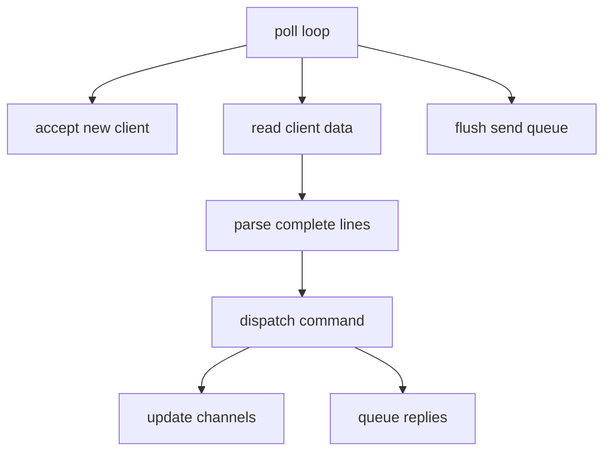
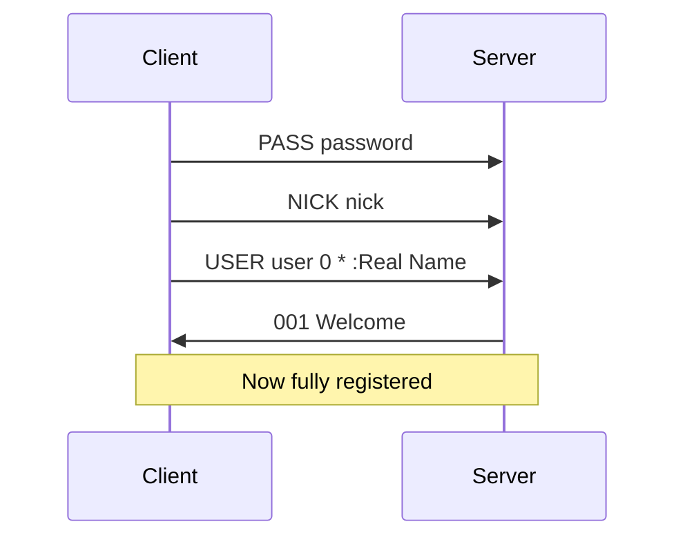

# IRC — Theory and concepts

## IRC protocol overview

IRC is a **text-based**, line-oriented protocol over TCP. Each message ends with `\r\n`.

### Message structure

```text
[:prefix] COMMAND [param [param ...]] [:trailing]\r\n
```

Examples:

```text
PASS secret\r\n
NICK alice\r\n
USER alice 0 * :Alice User\r\n
JOIN #general\r\n
PRIVMSG #general :Hello everyone\r\n
```

### Reply numerics

Server responds with 3-digit codes:

| Code | Meaning |
|------|---------|
| 001 | Welcome (RPL_WELCOME) |
| 433 | Nickname in use |
| 401 | No such nick/channel |
| 482 | Not channel operator |
| 475 | Cannot join (bad key) |

Reference clients depend on correct numerics during registration — study RFC 2812 numeric list.

---

## Server architecture

### Event-driven model



### Why non-blocking

With one thread and one `poll()`, no client can block the whole server waiting on `recv`. Every socket is `O_NONBLOCK`; partial reads are normal.

### Read buffering

TCP is a byte stream — one `recv` may contain half a message or multiple messages:

```text
Buffer: "PRIVMSG #foo :hel"
Buffer: "PRIVMSG #foo :hello\r\nJOIN #bar\r\n"
```

Split on `\r\n`, process complete lines only.

### Write buffering

If `send` returns `EAGAIN`, queue remaining bytes and wait for `POLLOUT`.

---

## Core objects

### Server

- Listening socket fd
- `std::map<int, Client>` or `vector<Client>` keyed by fd
- `std::map<std::string, Channel>` by channel name
- Password
- Main `poll()` loop

### Client

| Field | Purpose |
|-------|---------|
| fd | Socket |
| nickname, username | Identity after registration |
| registered | Passed PASS+NICK+USER |
| readBuffer | Incomplete input |
| sendQueue | Pending output |
| channels | Membership set |

### Channel

| Field | Purpose |
|-------|---------|
| name | e.g. `#general` |
| topic | Channel topic string |
| members | Clients in channel |
| operators | Subset with privileges |
| modes | `i`, `t`, `k`, `o`, `l` state + key + limit |

---

## Registration flow



Rules:

- Wrong `PASS` → disconnect or error numerics
- Duplicate `NICK` → `433` and request new nick
- Commands like `JOIN` before registration → error

---

## Commands (mandatory)

### Connection / session

| Command | Role |
|---------|------|
| `PASS` | Authenticate with server password |
| `NICK` | Set/display nickname |
| `USER` | Register user identity |

### Channels

| Command | Role |
|---------|------|
| `JOIN` | Enter channel (`#name`); create if missing |
| `PART` | Leave channel |
| `TOPIC` | View or set topic |

### Messaging

| Command | Role |
|---------|------|
| `PRIVMSG` | Private or channel message |
| `NOTICE` | Same syntax; typically no automatic replies |

Target forms:

- `#channel` — broadcast to channel
- `nickname` — direct message

### Operator-only

| Command | Role |
|---------|------|
| `KICK` | Remove user from channel |
| `INVITE` | Invite user to `+i` channel |
| `MODE` | View/set channel modes |

---

## Channel modes

| Mode | Flag | Effect |
|------|------|--------|
| invite-only | `+i` | Only invited users may `JOIN` |
| topic restricted | `+t` | Only operators set `TOPIC` |
| channel key | `+k` | Password required to join |
| operator | `+o` | Grant/remove operator to user |
| user limit | `+l` | Max members |

Examples:

```text
MODE #chan +i
MODE #chan +k secret
MODE #chan +l 10
MODE #chan +o alice
```

Parsing `MODE` is notoriously fiddly — parameter order matters per mode.

---

## Broadcasting

When client sends `PRIVMSG #channel :text`:

1. Verify sender is in channel
2. Build `:nick!user@host PRIVMSG #channel :text\r\n`
3. Send to every other member in channel (not always echo to sender — match reference client behavior)

---

## Common pitfalls

| Issue | Symptom |
|-------|---------|
| Blocking `recv` | One slow client freezes server |
| I/O without `poll()` | Subject: grade **0** |
| No send buffer | Lost messages on `EAGAIN` |
| Wrong line endings | Client hangs waiting for `\r\n` |
| Missing numerics | Client disconnects at registration |
| No `PONG` reply | Client times out and disconnects |
| Mode parsing bugs | `+ok` vs `+o nick` confusion |
| Nick not updated on channel relay | Wrong prefix in messages |
| Partial TCP reads | `nc -C` split test fails |
| Server crash on edge case | Subject: grade **0** |

---

## Subject vs RFC — scope traps

The PDF names **capabilities**, not every IRC command. Mandatory capabilities map to `PASS`, `NICK`, `USER`, `JOIN`, `PRIVMSG`, `KICK`, `INVITE`, `TOPIC`, `MODE`.

| Command | In subject PDF? | Practical need |
|---------|------------------|----------------|
| `PASS` / `NICK` / `USER` | Implied (auth, nick, user) | Required |
| `JOIN` / `PRIVMSG` | Implied | Required |
| `KICK` / `INVITE` / `TOPIC` / `MODE` | Explicit | Required |
| `PING` / `PONG` | Not listed | Almost always needed for real clients |
| `PART` / `QUIT` | Not listed | Expected in normal client use |
| `NOTICE` | Not listed | Optional unless client sends it |
| `NAMES` / `LIST` / `WHO` | Not listed | May be needed for channel user lists in GUI clients |

Channel `PRIVMSG` must reach **every other** client in the channel (subject wording) — not necessarily echoed back to the sender depending on client.

---

## Evaluation rehearsal

Be ready to demonstrate live:

1. Start server: `./ircserv 6667 mypass`
2. Connect two reference clients with same password
3. Join same channel, exchange messages
4. Operator kicks user, sets `+i`, tests `INVITE`
5. Wrong password rejected
6. Explain `poll()` loop on whiteboard
7. **Live modification** — evaluators may ask for a small on-the-spot code change (few minutes) to verify understanding

### Subject partial-data test

```bash
nc -C 127.0.0.1 6667
```

Send a command in fragments with Ctrl+D (`com`, `man`, `d` + newline). Server must buffer until a full `\r\n`-terminated line exists.

---

## RFC reading order

1. [RFC 2812](https://www.rfc-editor.org/rfc/rfc2812) — message format, core commands
2. [RFC 1459](https://www.rfc-editor.org/rfc/rfc1459) — historical reference, mode details

Do not implement server-to-server (RFC 2813) — out of scope.
