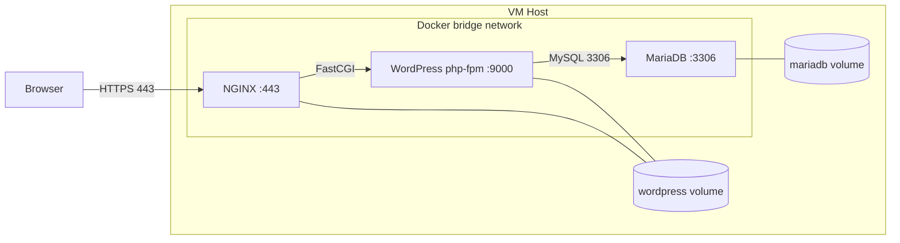

# Inception — Theory and concepts

---

## Why this project exists

Inception teaches **system administration** through **containerization**: package services, isolate them, persist data, and orchestrate a multi-service application reproducibly inside a VM.

---

## Containers vs virtual machines

| | Virtual Machine | Docker Container |
|---|-----------------|------------------|
| Isolation | Full OS + kernel | Shared host kernel, isolated processes/fs |
| Size | GBs | MBs typical |
| Boot | Minutes | Seconds |
| Use here | One Debian VM hosts all containers | NGINX, WP, MariaDB each in a container |

**Inception uses both:** a VM satisfies the subject; containers run inside it.

---

## Docker core concepts

### Image

Read-only template built from a **Dockerfile**. Layers are cached — changing early `RUN` lines invalidates cache below.

### Container

Running instance of an image. Ephemeral layer on top; **data must live in volumes**.

### Dockerfile

Instructions: base image → install packages → copy configs → set entrypoint/CMD.

### Docker Compose

YAML file declaring services, build contexts, env, networks, volumes. One command starts the stack.

### Volume

Storage **outside** container lifecycle. Two required:

| Volume | Holds |
|--------|--------|
| MariaDB | Database files (`/var/lib/mysql`) |
| WordPress | PHP files, uploads, themes (`/var/www/html`) |

Bind mount to `/home/<login>/data/...` on VM host.

### Network

User-defined **bridge** network: Docker DNS resolves service names (`mariadb`, `wordpress`, `nginx`).

Forbidden: `network_mode: host`, legacy `links:`.

---

## Architecture



### Request flow (detailed)

1. **Browser** → `https://login.42.fr:443` → hits VM (port forward) → **NGINX container**
2. **NGINX** terminates TLS, serves static files from volume
3. For `*.php`, NGINX forwards to `wordpress:9000` (FastCGI)
4. **PHP-FPM** runs WordPress, queries **MariaDB** at `mariadb:3306`
5. HTML returns NGINX → browser

Only NGINX publishes port 443 to the VM. MariaDB and WordPress are internal.

---

## Service deep dives

### NGINX

**Role:** Reverse proxy, TLS termination, static file server.

| Topic | Detail |
|-------|--------|
| TLS | Self-signed cert via OpenSSL in entry script |
| Protocols | TLSv1.2 and TLSv1.3 only |
| Port | 443 only (no 80) |
| FastCGI | `fastcgi_param SCRIPT_FILENAME`, pass to `wordpress:9000` |
| Config | `server_name login.42.fr;`, `root /var/www/html/...` |

NGINX and WordPress **share** the WordPress volume so NGINX can `try_files` static assets.

### WordPress + PHP-FPM

**Role:** CMS application; no NGINX inside this container.

| Topic | Detail |
|-------|--------|
| php-fpm | Listens TCP `9000` for cross-container FastCGI |
| Install | WP-CLI `wp core download` + `wp core install` |
| Users | Admin + regular user; admin login ≠ `admin` / `administrator` |
| Config | `DB_HOST=mariadb`, credentials from env |
| `clear_env` | Must be `no` in pool config so PHP sees env vars |

### MariaDB

**Role:** Relational database for WordPress tables.

| Topic | Detail |
|-------|--------|
| Init | Create database, user, `GRANT` on first start |
| Config | `bind-address = 0.0.0.0` for inter-container TCP |
| Exposure | Internal network only — not mapped to VM host |
| Persistence | Volume on `/var/lib/mysql` |

---

## Environment variables

All secrets in `srcs/.env` (not committed). Typical variables:

```env
DOMAIN_NAME=login.42.fr

MYSQL_DATABASE=wordpress
MYSQL_USER=wpuser
MYSQL_PASSWORD=...
MYSQL_ROOT_PASSWORD=...

WORDPRESS_DB_HOST=mariadb:3306
WORDPRESS_DB_NAME=wordpress
WORDPRESS_DB_USER=wpuser
WORDPRESS_DB_PASSWORD=...

WP_TITLE=Inception
WP_ADMIN_USER=boss42
WP_ADMIN_PASSWORD=...
WP_ADMIN_EMAIL=boss@student.42.fr
WP_USER=author42
WP_USER_PASSWORD=...
WP_USER_EMAIL=author@student.42.fr
```

Exact names follow your subject — align with `docker-compose.yml` and entry scripts.

---

## Process management (PID 1)

Each container needs a proper **foreground** main process:

- MariaDB: `mysqld`
- PHP-FPM: `php-fpm -F` (foreground)
- NGINX: `nginx -g 'daemon off;'`

Use `exec` in entry scripts so signals reach the daemon.

**Forbidden as primary process:** `tail -f /dev/null`, `sleep infinity`, `while true` — subject bans these as keep-alive hacks.

---

## Restart policy

`restart: always` — Docker restarts crashed containers. Required for evaluation resilience.

---

## Image naming rules

- Image name = service name (per subject)
- Base: `debian:<version>` or `alpine:<version>` — **penultimate stable**
- No `nginx:latest`, `wordpress:latest`, etc.

---

## Common evaluation failures

| Mistake | Why it fails |
|---------|--------------|
| Pre-built WP/NGINX/MariaDB images | Violates build-from-scratch rule |
| Password in Dockerfile | Security rule |
| Port 80 exposed | NGINX must be 443 only |
| `host` network | Breaks isolation requirement |
| Data in container layer | Lost on rebuild — need volumes |
| Admin username `admin` | Subject rule |
| TLS 1.0/1.1 enabled | Protocol rule |

---

## Bonus concepts (optional)

| Service | Purpose |
|---------|---------|
| **Redis** | Object cache — fewer DB hits |
| **Adminer** | Web UI for MariaDB |
| **FTP** | File upload to WP volume |
| **Static site** | Simple HTML alongside WP |

Bonuses must not break mandatory requirements.

---

## Further reading

- [Docker docs — Compose](https://docs.docker.com/compose/)
- [NGINX — FastCGI PHP](https://nginx.org/en/docs/http/ngx_http_fastcgi_module.html)
- [WordPress — wp-config.php](https://developer.wordpress.org/advanced-administration/wordpress/wp-config/)
- [MariaDB — Docker notes](https://mariadb.com/kb/en/installing-mariadb-on-docker/)
