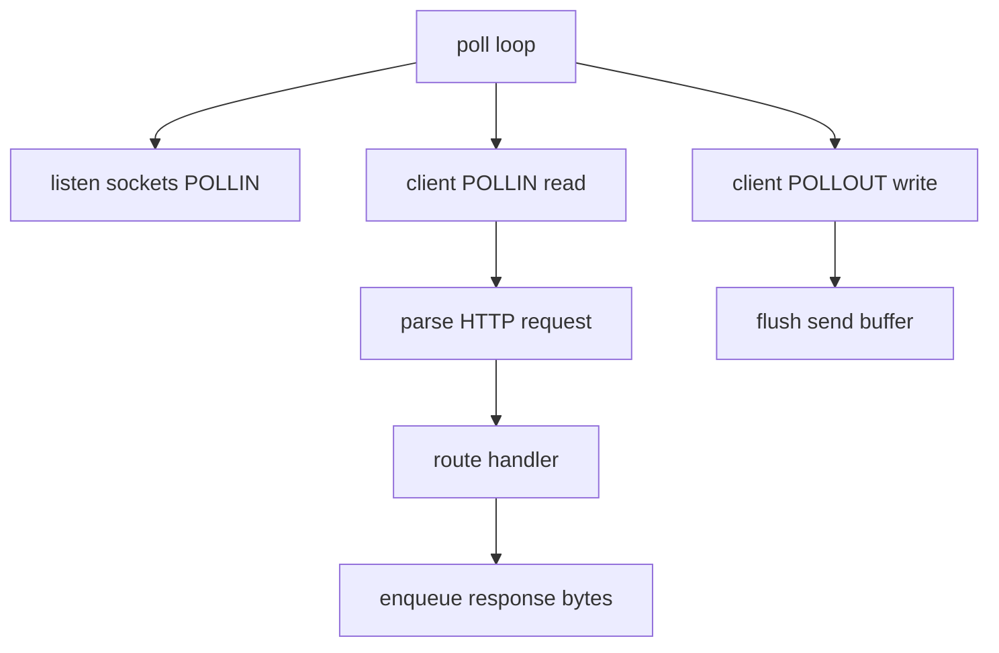

# Webserve — Exercise breakdown (ft_webserve)

Source: campus **ft_webserve** PDF. When PDF and this doc differ, **the PDF and evaluation sheet win**.

---

## How project validation works

ft_webserve is a **single mandatory project** — there are no optional exercises. Bonus features are graded only if mandatory is **perfect**.

| | |
|---|---|
| **Program name** | `webserv` |
| **Run** | `./webserv [configuration file]` |
| **Files** | `Makefile`, `*.{h,hpp}`, `*.cpp`, `*.tpp`, `*.ipp`, config samples |
| **Makefile** | `$(NAME)`, `all`, `clean`, `fclean`, `re` |
| **External libs** | Forbidden (no Boost, no libhttp) |

### C++ standard

The subject PDF requires **C++98** (`-std=c++98`). The Hive campus norm for CPP modules is **C++20**. Confirm with your evaluation sheet which flag evaluators use. Safe approach: write code that compiles cleanly with **both** `-std=c++98` and `-std=c++20` until you know otherwise.

---

## Module concepts

### HTTP request structure

```http
GET /index.html HTTP/1.1\r\n
Host: localhost:8080\r\n
Connection: close\r\n
\r\n
```

- Request line: `METHOD SP REQUEST-TARGET SP HTTP/VERSION`
- Headers: `Key: Value` until empty line
- Body: optional; length from `Content-Length` or `chunked` encoding

### HTTP response structure

```http
HTTP/1.1 200 OK\r\n
Content-Type: text/html\r\n
Content-Length: 13\r\n
Connection: close\r\n
\r\n
Hello, world!
```

Status line + headers + blank line + body.

### Event-driven server



Same family as ft_irc — one multiplexer loop drives all I/O.

### Config → routing

```
URI /kapouet/pouic  +  location /kapouet  +  root /tmp/www
→ filesystem path /tmp/www/pouic
```

Longest prefix match is the usual NGINX semantics — implement consistently.

### MIME types

Map extension to `Content-Type`:

| Ext | Type |
|-----|------|
| `.html` | `text/html` |
| `.css` | `text/css` |
| `.png` | `image/png` |
| `.jpg` | `image/jpeg` |

Unknown → `application/octet-stream`.

### Connection state machine

Typical states per client:

1. `READING_HEADERS`
2. `READING_BODY`
3. `GENERATING_RESPONSE` (may include CGI child)
4. `WRITING_RESPONSE`
5. `DONE` / `CLOSE`

### Virtual hosts

Match `Host` header to `server_name` when multiple `server` blocks share logic. Default server catches unmatched names.

### Security mindset (study)

- Reject path traversal (`../` outside root)
- Limit upload size
- Do not execute arbitrary paths as CGI — only configured extensions

---

## Architecture & event loop

### Concepts

When `read`/`recv` returns `EAGAIN`/`EWOULDBLOCK`, stop and wait for next `poll()` — do not spin.

Register **POLLOUT** only when send buffer has data — avoid busy loops.

**errno prohibition** — subject forbids branching on `errno` after I/O. Handle short reads/writes via return values and non-blocking fd behavior without reading `errno` — design with that constraint from day one (use poll readiness as primary signal).

### Requirements

| Requirement | Detail |
|-------------|--------|
| Non-blocking | All client and listen sockets non-blocking (`fcntl` `O_NONBLOCK`) |
| Single multiplexer | **One** `poll()` (or `select` / `epoll` / `kqueue`) for **all** I/O including listen |
| Read/write rule | **Never** `read`/`write`/`send`/`recv` without multiplexer readiness |
| `poll` checks | Must monitor **read and write** simultaneously |
| Config file | May be read **without** `poll()` (explicit exception) |
| `fork` | **Only** for CGI — nowhere else |
| `errno` | **Forbidden** to check after read/write operations |
| Crash | Server must not crash on bad requests or memory pressure |

### Pitfalls & evaluator checks

| Pitfall | Evaluator check |
|---------|-----------------|
| I/O outside event loop | Same as ft_irc: grade **0** |
| Blocking `accept` or `read` | Server hangs under load |
| `errno` after I/O | Subject violation |
| `fork` outside CGI | Fail |
| Leaks / crash on bad config | Fail |

---

## HTTP methods & request parsing

### Concepts

Parse request line, headers (until `\r\n\r\n`), then body per `Content-Length` or `chunked` encoding. Route to handler based on config match.

### Requirements

| Method | Required use |
|--------|--------------|
| `GET` | Serve files, directories, trigger GET CGI |
| `POST` | Uploads, POST body to CGI |
| `DELETE` | Remove resources where configured |

Return correct status codes: `200`, `301`/`302`, `403`, `404`, `405`, `413`, `500`, etc.

### Pitfalls & evaluator checks

| Pitfall | Evaluator check |
|---------|-----------------|
| Wrong status or missing headers | Browser/curl tests fail |
| Method not allowed | `405` when `allow_methods` restricts |
| Body size exceeded | `413` when over `client_max_body_size` |

---

## Configuration

### Concepts

NGINX-like blocks: `server { ... }`, `location { ... }`. Multiple `server` blocks on different ports; `server_name` for virtual host matching.

### Requirements

**Server block:**

| Directive | Purpose |
|-----------|---------|
| `listen` | Port (multiple servers → multiple ports) |
| `server_name` | Virtual host matching (eval may test Host header) |
| `root` | Default filesystem root |
| `index` | Default file for directory requests |
| `client_max_body_size` | Max upload body |
| `error_page` | Custom error HTML paths |

**Location / route rules** — routes are **not** regex-based in the subject:

| Feature | Detail |
|---------|--------|
| `allow_methods` | Limit GET/POST/DELETE |
| `return` | HTTP redirect |
| Root alias | URL prefix maps to filesystem path |
| `autoindex` | Directory listing on/off |
| `index` | Default file for directory |
| CGI extension | e.g. `.php` → CGI handler |
| Upload path | Save POST files to configured directory |

### Pitfalls & evaluator checks

| Pitfall | Evaluator check |
|---------|-----------------|
| Wrong path mapping | Longest prefix match must be consistent |
| Virtual host mismatch | `Host` header must route to correct `server` block |
| Config syntax errors | Reject with clear messages |

---

## Static website

### Concepts

Serve files with correct `Content-Type` from MIME mapping (see Module concepts).

### Requirements

Must serve a **complete static site** from your config (HTML, CSS, images). Evaluators compare with browser and `curl`.

### Pitfalls & evaluator checks

| Pitfall | Evaluator check |
|---------|-----------------|
| Path traversal | `../` outside root must be rejected |
| Missing index | Directory requests serve configured `index` or `autoindex` |
| Wrong MIME type | Browser renders incorrectly |

---

## CGI

### Concepts

**Chunked transfer encoding** — decoder loop:

```
read chunk size (hex)
read chunk data + CRLF
repeat until size 0
```

After decoding, CGI receives contiguous body on stdin.

**CGI process model:**

```
parent: socket client
  pipe_in  → child stdin  (POST body)
  pipe_out ← child stdout (CGI response headers/body)
  fork → execve(cgi_binary, argv, envp)
parent: read CGI output, build HTTP response
```

**Never** `fork` per connection — only per CGI request.

### Requirements

| Rule | Detail |
|------|--------|
| Invocation | Full script path as `PATH_INFO`; program as first arg to exec |
| Working directory | `chdir` to script's directory for relative paths |
| Environment | Standard CGI variables (see table below) |
| Chunked requests | Server **unchunks** body before CGI; CGI sees EOF at body end |
| CGI output | If no `Content-Length` from CGI, EOF ends response body |
| Languages | At least one working CGI (PHP-CGI, Python, etc.) |

| Variable | Meaning |
|----------|---------|
| `REQUEST_METHOD` | GET, POST, … |
| `PATH_INFO` | Path to script |
| `QUERY_STRING` | After `?` in URL |
| `CONTENT_LENGTH` | Body size |
| `SERVER_PROTOCOL` | HTTP/1.1 |

### Pitfalls & evaluator checks

| Pitfall | Evaluator check |
|---------|-----------------|
| No chunked POST support | CGI POST fails |
| `fork` per connection | Subject violation — only per CGI request |
| Wrong CGI env | Script fails to read method/body |
| Arbitrary path execution | Only configured extensions run as CGI |

---

## Error pages

### Concepts

Custom HTML error pages improve eval presentation; map status codes to configured files.

### Requirements

Serve configured error pages for at least **404** and other common errors — subject lists minimum set.

### Pitfalls & evaluator checks

| Pitfall | Evaluator check |
|---------|-----------------|
| Missing 404 page | Evaluators test unknown routes |
| Wrong error page path | `error_page` directive must resolve |

---

## Bonus

Typical bonuses (confirm PDF):

- Cookies / sessions
- Multiple CGI types
- Advanced load testing resilience

**Bonus is only graded if mandatory is PERFECT.**

---

## Module checklist

- [ ] `./webserv [config]` starts and listens on configured ports
- [ ] Builds with `-Wall -Wextra -Werror` and subject standard flag
- [ ] Makefile: `NAME`, `all`, `clean`, `fclean`, `re`
- [ ] All sockets non-blocking; one `poll()` drives all I/O
- [ ] `GET` / `POST` / `DELETE` work per config
- [ ] Static site serves correctly in browser and `curl`
- [ ] CGI works for at least one language
- [ ] Chunked POST to CGI succeeds
- [ ] Redirects (`return`) work
- [ ] Upload size limit enforced
- [ ] Error pages served for 404 and others
- [ ] No leaks; server survives bad requests without crash

### Evaluation topics to rehearse

| Trap | Consequence |
|------|-------------|
| Blocking `accept` or `read` | Hangs → fail |
| `errno` after I/O | Subject violation |
| `fork` outside CGI | Fail |
| Wrong status or missing headers | Browser/curl tests fail |
| No chunked POST support | CGI POST fails |
| Leaks / crash on bad config | Fail |

### Comparison with IRC

| | IRC | Webserve |
|---|-----|----------|
| Protocol | Line-based text | HTTP with headers + body |
| Config | CLI args | File parser |
| `fork` | Forbidden | CGI only |
| Message format | `\r\n` commands | `\r\n\r\n` header end |

Both share the single `poll()` event-loop pattern — studying IRC first helps socket/non-blocking skills.
