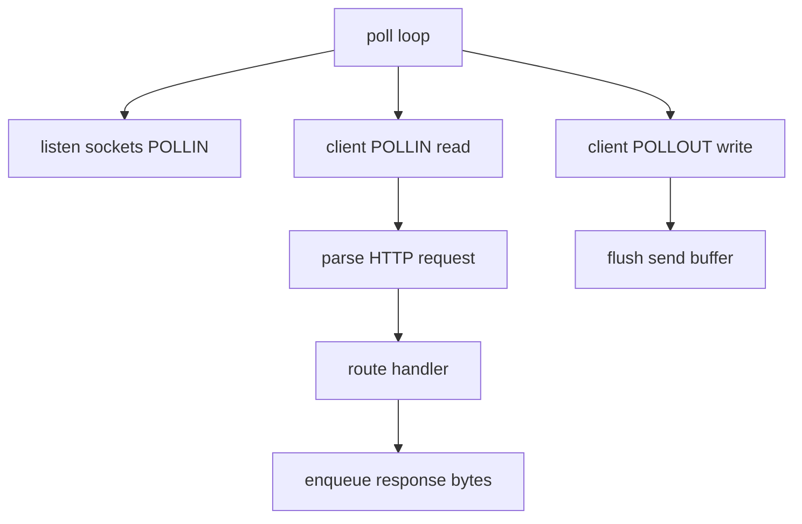

# Webserve — Theory and concepts

## HTTP request structure

```http
GET /index.html HTTP/1.1\r\n
Host: localhost:8080\r\n
Connection: close\r\n
\r\n
```

- Request line: `METHOD SP REQUEST-TARGET SP HTTP/VERSION`
- Headers: `Key: Value` until empty line
- Body: optional; length from `Content-Length` or `chunked` encoding

## HTTP response structure

```http
HTTP/1.1 200 OK\r\n
Content-Type: text/html\r\n
Content-Length: 13\r\n
Connection: close\r\n
\r\n
Hello, world!
```

Status line + headers + blank line + body.

## Event-driven server (same family as IRC)



## Non-blocking I/O

When `read`/`recv` returns `EAGAIN`/`EWOULDBLOCK`, stop and wait for next `poll()` — do not spin.

Register **POLLOUT** only when send buffer has data — avoid busy loops.

## Config → routing

```
URI /kapouet/pouic  +  location /kapouet  +  root /tmp/www
→ filesystem path /tmp/www/pouic
```

Longest prefix match is the usual NGINX semantics — implement consistently.

## MIME types

Map extension to `Content-Type`:

| Ext | Type |
|-----|------|
| `.html` | `text/html` |
| `.css` | `text/css` |
| `.png` | `image/png` |
| `.jpg` | `image/jpeg` |

Unknown → `application/octet-stream`.

## Chunked transfer encoding

Decoder loop:

```
read chunk size (hex)
read chunk data + CRLF
repeat until size 0
```

After decoding, CGI receives contiguous body on stdin.

## CGI process model

```
parent: socket client
  pipe_in  → child stdin  (POST body)
  pipe_out ← child stdout (CGI response headers/body)
  fork → execve(cgi_binary, argv, envp)
parent: read CGI output, build HTTP response
```

**Never** `fork` per connection — only per CGI request (subject allows fork for CGI).

### Key environment variables

| Variable | Meaning |
|----------|---------|
| `REQUEST_METHOD` | GET, POST, … |
| `PATH_INFO` | Path to script |
| `QUERY_STRING` | After `?` in URL |
| `CONTENT_LENGTH` | Body size |
| `SERVER_PROTOCOL` | HTTP/1.1 |

## errno prohibition

Subject forbids branching on `errno` after I/O. Handle short reads/writes via return values and `EAGAIN` from non-blocking fds without reading `errno` — design with that constraint from day one (use poll readiness as primary signal).

## State machine per connection

Typical states:

1. `READING_HEADERS`
2. `READING_BODY`
3. `GENERATING_RESPONSE` (may include CGI child)
4. `WRITING_RESPONSE`
5. `DONE` / `CLOSE`

## Virtual hosts

Match `Host` header to `server_name` when multiple `server` blocks share logic. Default server catches unmatched names.

## Security mindset (study)

- Reject path traversal (`../` outside root)
- Limit upload size
- Do not execute arbitrary paths as CGI — only configured extensions
