# Transcendence — Theory and concepts

Study guide aligned with **ft_transcendence** subject **version 19.0**. The project is a team-built web application whose *idea is yours* — Pong is one example path, not the default. Verify wording on your intranet PDF before defense.

---

## Subject AI instructions (Chapter I)

The subject opens with guidance on ethical AI use. Treat this as part of eval preparedness, not optional reading.

| Principle | What it means in practice |
|-----------|---------------------------|
| Use AI to reduce tedium | Boilerplate, docs drafts, test ideas — then verify yourself |
| Develop prompting skills | Clear, domain-specific prompts beat vague “build my app” requests |
| Understand what you ship | Only commit AI output you can explain and defend |
| Check and test systematically | AI hallucinates APIs, misstates security, and invents dependencies |
| Peer review is mandatory culture | Peers catch context AI lacks; use them before evaluators do |

**Eval preparedness:** Exams and peer-evaluation require *demonstrated understanding*. Copy-pasting AI code you cannot explain costs credibility and can fail the project. Good pattern: AI suggests → you implement or adapt → peer reviews → you can walk through logic live.

**Power skills:** Computational thinking, problem-solving, adaptability, and collaboration matter as much as framework fluency. Explaining trade-offs to teammates mirrors explaining architecture to evaluators.

---

## Team organization

Transcendence is a **group project (4–5 people)**. Poor early coordination wastes weeks. Roles must be documented in `README.md`.

### Required roles

| Role | Responsibility |
|------|----------------|
| **Product Owner (PO)** | Product vision, backlog, feature priorities, validates completed work, speaks to stakeholders (evaluators) |
| **Project Manager (PM) / Scrum Master** | Meetings, progress tracking, communication, risk/blocker management |
| **Technical Lead / Architect** | Architecture, stack decisions, code quality, reviews critical changes |
| **Developers (all members)** | Implement features/modules, code review, test, document |

**Team size:**

- **4 people:** Some members hold multiple roles (e.g. PM + Developer, PO + Developer).
- **5 people:** Roles can be more specialized (dedicated PO, PM, Tech Lead, two Developers).

### Recommended practices (strongly suggested)

Regular syncs, task tracking (GitHub Issues, Trello, etc.), work breakdown, code reviews, decision notes, and a team chat (Discord, Slack).

### Evaluation questions (team)

Evaluators typically ask:

- How were roles distributed?
- How was work organized and divided?
- How did you communicate and coordinate?
- What did **each member** contribute?

**Every member** must explain the project and their own contributions. “I only did the CSS” is not a defense strategy if you cannot describe the backend or database.

---

## Project scoping — 14 coherent module points

You need **14 points** from modules: **Major = 2 pts**, **Minor = 1 pt**. Aim higher than 14 — incomplete modules score **0**.

### Scoping workflow

1. **Pick an idea** that motivates the whole team for months.
2. **List candidate modules** that fit the idea (not the reverse).
3. **Check dependencies** — gaming modules need a game; advanced chat needs basic chat; game stats need a game.
4. **Sum points** and confirm the combination is realistic in your timeline.
5. **Assign module owners** before deep implementation.

### Valid mandatory examples (subject)

The application can be many things:

- Multiplayer Pong with tournaments
- Collaborative platform with real-time features
- Social network
- Online game (Chess, Tic-Tac-Toe) with matchmaking
- Project management app
- Any creative web app meeting mandatory + module requirements

### Chapter V archetypes

Use these as inspiration, not prescriptions.

| Archetype | Examples | Typical module themes |
|-----------|----------|------------------------|
| **Gaming** | Pong, Chess, card games, battle royale, trivia | Web-based game, remote players, tournament, AI opponent, gamification |
| **Social & collaborative** | Social network, forum, event platform, LMS | User interaction, real-time, notifications, organizations, permissions |
| **Creative & media** | Music/video sharing, art gallery, blogging, recipes | File upload, recommendations, search, moderation, SSR/i18n |
| **Productivity & tools** | Task manager, code sharing, booking, marketplace, fitness tracker | Organizations, collaborative editing, public API, analytics |
| **Specialized** | Trading simulator, language learning, pet adoption, travel, crowdfunding | Real-time data, gamification, multi-language, recommendations |

**Pong path (one worked example):** Web game (2) + remote players (2) + tournament (1) + customization (1) + standard user mgmt (2) + OAuth (1) + full-stack frameworks (2) + ORM (1) + AI opponent (2) = **14**. Mix categories freely — coherence matters more than genre.

---

## Mandatory baseline (Chapters III–III.3)

Separate **fixed core** (every team) from **optional modules**.

### General requirements

| Requirement | Detail |
|-------------|--------|
| Web application | Frontend + backend + database |
| Git | Meaningful commits from **all** members; visible work distribution |
| Container deployment | Docker, Podman, or equivalent — **single command** to run |
| Browser | Latest stable **Google Chrome**; no console warnings/errors |
| Legal pages | Accessible **Privacy Policy** and **Terms of Service** — real content, footer links; placeholders = rejection |

### Multi-user architecture (mandatory)

The site must support **multiple users simultaneously**. This is core architecture, not a module checkbox.

| Concern | What evaluators expect |
|---------|------------------------|
| Concurrent sessions | Many users logged in and active at once |
| Concurrent actions | Different users acting at the same time without breaking state |
| Real-time sync | When applicable, updates visible across connected clients |
| Data integrity | No corruption or **race conditions** from simultaneous writes |

**Design implications:**

- **Server authority:** For shared state (scores, room membership, edits), pick one source of truth — usually the backend or a dedicated game service.
- **Transactions / locking:** Database updates that read-modify-write need transactions, row locks, or atomic operations.
- **Idempotency:** Retried requests (network flakes) should not double-charge or duplicate records.
- **Optimistic vs pessimistic concurrency:** UI may show optimistic updates, but reconcile with server truth on conflict.
- **WebSockets / SSE:** Push model scales better than polling for live features; still handle reconnect and stale state.

Even a “static” app with accounts hits this bar once two users edit profiles, post messages, or join the same room.

### Technical requirements (mandatory)

| Area | Requirement |
|------|-------------|
| Frontend | Clear, **responsive**, **accessible** on all devices |
| Styling | CSS framework or solution of your choice (Tailwind, Bootstrap, MUI, etc.) |
| Secrets | `.env` gitignored; `.env.example` provided |
| Database | Clear schema and defined relations |
| User management (basic) | Sign-up and login — **email + password** with proper hashing/salting |
| Validation | Frontend **and** backend on all forms/inputs |
| Backend transport | **HTTPS everywhere** |

**Not mandatory in v19:** SPA architecture, Pong, tournaments, OAuth, 2FA, WebSockets (unless chosen as modules). A multi-page server-rendered app is valid if it meets the above.

### Responsive design and accessibility (mandatory framing)

Responsive layout is part of the mandatory technical bar — not only an optional WCAG module.

| Mandatory bar | Module upgrade |
|---------------|----------------|
| Usable on mobile/tablet/desktop | **Major:** full WCAG 2.1 AA — screen readers, keyboard nav, assistive tech |
| Sensible layout and touch targets | **Minor:** 3+ languages, RTL, extra browsers |

Plan accessibility early: semantic HTML, focus order, labels, contrast, and keyboard paths are cheaper than retrofitting.

---

## Mandatory authentication vs module authentication

### Mandatory (baseline)

- Registration and login with **email + password**
- Passwords **hashed and salted** — never plaintext in DB or logs
- Session or token strategy you can explain (cookies, JWT, server sessions)

Use framework defaults where sound (bcrypt/argon2, Django `make_password`, etc.).

### Modules (optional extensions)

| Module | Concept |
|--------|---------|
| **OAuth 2.0** (minor) | Redirect to provider (Google, GitHub, 42) → authorization code → token exchange → link/create local user |
| **2FA** (minor) | After password OK: TOTP app, email OTP, or similar second step before full session |
| **Standard user management** (major) | Profiles, avatars, friends, online status |
| **Advanced permissions** (major) | CRUD users, roles (admin, moderator, guest), role-based UI/actions |

Baseline auth must work without OAuth/2FA. Modules add flows on top.

---

## Legal pages — Privacy Policy and Terms of Service

Mandatory, evaluated explicitly:

- Linked from the app (e.g. footer) on relevant screens
- **Substantive** content tailored to your app (data collected, cookies, user obligations)
- Not lorem ipsum or empty templates

Align policy text with what you actually store (accounts, chat logs, uploaded files, analytics).

---

## What counts as a “framework” (subject definition)

The PDF defines **framework** narrowly for module scoring:

A framework provides:

- Structured architecture and conventions
- Built-in features for common tasks (routing, state management, etc.)
- A complete ecosystem

| Frameworks (examples) | Not frameworks (examples) |
|-----------------------|---------------------------|
| **Frontend:** React, Vue, Angular, Svelte, Next.js | jQuery (library) |
| **Backend:** Express, Fastify, NestJS, Django, Flask, Ruby on Rails | Lodash (utility) |
| **Full-stack:** Next.js, Nuxt, SvelteKit — count as both if you use FE + BE capabilities | Axios (HTTP client) |

**Note:** React is treated as a framework in the subject because of ecosystem and architectural patterns.

Using only jQuery + raw Node handlers may satisfy mandatory parts but will not earn framework **modules** without qualifying stacks.

### SPA vs multi-page

**SPA is not mandatory.** Client-side routing (History API, React Router, etc.) is one way to build a frontend framework app. Server-rendered pages (Django templates, SSR module) are equally valid if responsive, accessible, and Chrome-clean.

| Approach | When it fits |
|----------|--------------|
| SPA + API | Rich client state, game loops, heavy interactivity |
| SSR / MPA | Content sites, forms-heavy flows, SEO (SSR module) |
| Hybrid | SSR shell + hydrated islands |

**Eval trap (if you claim SPA patterns):** Full page reloads for internal navigation contradict client-router expectations — but MPAs are fine if you are not claiming SPA-specific behavior.

---

## Module dependency graph (conceptual)

Plan modules so prerequisites are implemented first.

```mermaid
flowchart TD
    subgraph mandatory [Mandatory core]
        M1[Frontend + Backend + DB]
        M2[Basic auth email/password]
        M3[Multi-user concurrency]
        M4[Docker single-command deploy]
    end

    subgraph web [Web modules]
        W1[Frontend framework]
        W2[Backend framework]
        W3[Full-stack frameworks]
        W4[Real-time WebSockets]
        W5[User interaction chat/profile/friends]
        W6[Public API]
        W7[ORM]
        W8[Advanced chat]
    end

    subgraph gaming [Gaming modules]
        G1[Web-based game]
        G2[Remote players]
        G3[Multiplayer 3+]
        G4[Another game]
        G5[Tournament]
        G6[AI opponent]
        G7[Game stats]
        G8[Spectator / customization / gamification]
    end

    subgraph user [User management]
        U1[Standard user management]
        U2[OAuth]
        U3[2FA]
        U4[Advanced permissions]
        U5[Organizations]
    end

  mandatory --> W1
  mandatory --> W2
  mandatory --> W5
  W5 --> W8
  W1 --> W3
  W2 --> W3

  G1 --> G2
  G1 --> G3
  G1 --> G4
  G1 --> G5
  G1 --> G6
  G1 --> G7
  G1 --> G8

  W4 -.-> G2
  W4 -.-> G3

  M2 --> U1
  U1 --> U2
  U1 --> U3
```



**Hard rules from subject:**

- Gaming extensions (tournament, AI, spectator, 3+, second game, customization) → need **at least one game** first
- Game statistics → need a game
- Advanced chat → need **user interaction** (basic chat) first
- **SSR incompatible with ICP** blockchain backend module

During eval: demonstrate each claimed module; partial implementations = 0 points.

---

## Docker deployment

Reuse and extend **Inception** patterns for a multi-service web stack.

| Piece | Role |
|-------|------|
| `docker-compose.yml` | Define frontend, API, database, reverse proxy, optional workers |
| **Networks** | Internal DNS (`api`, `db`) — do not expose DB to the host unnecessarily |
| **Volumes** | Persist database data across container restarts |
| **Root `Makefile`** | `all` → build + up in one command (subject requirement) |
| **Reverse proxy** | TLS termination, static assets, routing to services |
| `.env` / `.env.example` | Secrets and config; never commit real credentials |

**Eval trap:** Evaluator runs one command — if compose fails on a clean machine (wrong paths, missing env, build context errors), mandatory deployment fails.

Dev/prod parity: same compose shape locally and for defense; document any host-specific overrides.

---

## Real-time communication and WebSockets

**Real-time features** are a **major Web module** (2 pts), not mandatory — but mandatory **multi-user** requirements often push teams toward push-based updates.

| Use case | Typical approach |
|----------|------------------|
| Live chat | WebSocket rooms or Socket.IO namespaces |
| Game state sync | Authoritative server broadcasting ticks/state |
| Notifications | WebSocket or Server-Sent Events (SSE) |
| Collaborative editing | Operational transforms or CRDTs over WebSocket |

| Term | Meaning |
|------|---------|
| **WS / WSS** | WebSocket plain / over TLS — use **WSS** when the site is HTTPS |
| **Room / channel** | Group connections for targeted broadcast (similar mental model to IRC channels) |
| **Heartbeat / reconnect** | Detect dead connections; resync state after drop |

**Connection lifecycle:** Handle connect, disconnect, reconnect, and auth on the socket (token in handshake or first message). Avoid trusting client-only game outcomes for competitive play.

**IRC parallel:** Event loop, fd sets, broadcast to peers, graceful disconnect — same ideas, higher-level API.

---

## Tournament flow (module, not mandatory)

Tournaments are a **minor Gaming module (1 pt)** requiring an implemented game. They are **not** part of the mandatory baseline in v19.

Conceptual flow if you claim the module:

```
Create tournament → Registration / aliases → Bracket or queue
    → Pair players → Play matches → Record results → Advance rounds → Champion
```

| Component | Responsibility |
|-----------|----------------|
| Registration | Unique participants per tournament |
| Matchmaking / bracket | Deterministic pairing and progression |
| Results | Persist outcomes; tie into stats/history modules if chosen |
| Admin / lifecycle | Create, start, cancel tournaments |

Blockchain module (major) can store tournament scores on-chain — another optional layer on top of a working tournament + game stack.

---

## Authentication and security concepts

### Password storage (mandatory)

Never store plaintext passwords. Use slow hashes (**bcrypt**, **argon2**) with per-user salt or framework-equivalent.

### OAuth 2.0 (module)

Typical authorization-code flow:

1. User clicks “Login with Provider”
2. Redirect to provider consent screen
3. Callback with `code` to your backend
4. Backend exchanges code for tokens (client secret server-side only)
5. Create or link local user; issue your session/JWT

Store provider IDs; handle email collision and account linking policies.

### 2FA (module)

Flow: primary auth succeeds → challenge second factor (TOTP, email code) → issue full session. Recovery codes and device trust are good design topics for defense.

### JWT (if used)

Short-lived access token + optional refresh; validate signature and claims on every protected route. JWT is not required by the subject but appears in many stacks — know trade-offs vs server-side sessions.

### SQL injection prevention (mandatory discipline)

**Never** concatenate user input into SQL strings.

| Safe | Unsafe |
|------|--------|
| Parameterized queries / prepared statements | `"SELECT * FROM users WHERE id = " + id` |
| ORM query APIs with bound parameters | Raw string building from `req.body` |

Also validate and sanitize on the backend — frontend validation is UX, not security.

### Other security modules

| Module | Study focus |
|--------|-------------|
| **WAF + Vault** (major) | ModSecurity rules; secrets in HashiCorp Vault, not in images |
| **GDPR** (minor) | Export, deletion, confirmation flows |
| **Advanced permissions** | Role checks on every sensitive route |

HTTPS everywhere on the backend is mandatory; terminate TLS at proxy or app consistently.

---

## Module categories (v19 reference)

Ten categories; pick any mix totaling ≥ 14 points.

| Category | Example modules |
|----------|-----------------|
| **Web** | Full-stack frameworks, real-time, user interaction, public API, ORM, notifications, collaborative editing, SSR, PWA, design system, search, file upload |
| **Accessibility & i18n** | WCAG 2.1 AA, 3 languages, RTL, extra browsers |
| **User management** | Profiles/friends, game stats, OAuth, permissions, organizations, 2FA, activity dashboard |
| **Artificial intelligence** | AI opponent, RAG, LLM interface, recommendations, moderation, voice, sentiment, image tagging |
| **Cybersecurity** | WAF + Vault |
| **Gaming & UX** | Web game, remote/multiplayer, second game, 3D, advanced chat, tournament, customization, gamification, spectator |
| **DevOps** | ELK, Prometheus/Grafana, microservices, health/backups |
| **Data & analytics** | Dashboards, export/import, GDPR |
| **Blockchain** | Avalanche/Solidity scores; ICP backend (no SSR combo) |
| **Modules of choice** | Custom major/minor with README justification |

**Over-claiming kills scores:** List only modules you can demo end-to-end.

---

## README and evaluation (Chapters VI–VII)

The README is a graded artifact. Required sections include team roles, project management, stack justification, **database schema**, features list with owners, **module list with point math**, individual contributions, and **how AI was used**.

Peer-evaluation may include a **short live modification** (small behavior change, few lines of code) to verify understanding — be ready to edit your own codebase without AI.

---

## Relation to prior projects

| Prior project | Transcendence parallel |
|---------------|------------------------|
| **Inception** | Docker Compose, networks, volumes, TLS reverse proxy, env secrets, single-command deploy |
| **IRC** | Many concurrent connections, broadcast, channels/rooms, disconnect handling — maps to WebSockets and chat |
| **Exam Rank 06** (`mini_serv`) | TCP, `select()`/`poll()`, multiple clients — do before or early in Transcendence; underpins socket intuition |
| **Webserve / HTTP** | Request parsing, status codes, headers — REST API design |
| **CPP modules** | Less central; OOP and clean interfaces still help in larger codebases |

---

## Study checklist before defense

- [ ] Can every member explain architecture and their contributions?
- [ ] Does `make` / one compose command work on a fresh clone with `.env.example`?
- [ ] Privacy Policy and ToS linked and substantive?
- [ ] Password hashing and SQL parameterization demonstrable?
- [ ] Multi-user scenario tested (two browsers, concurrent actions, no races)?
- [ ] Chrome console clean on main flows?
- [ ] Each claimed module demoable in under a few minutes?
- [ ] README point total matches implemented modules?
- [ ] AI usage documented honestly in README Resources section?
